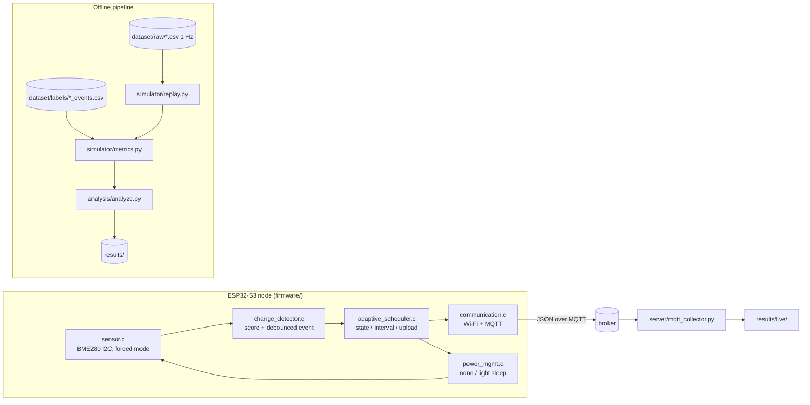

# AdaptiveSense

**Change-aware adaptive sampling for resource-constrained IoT nodes**

[](https://github.com/Sver0411/AdaptiveSense/actions/workflows/python-tests.yml)
[](https://github.com/Sver0411/AdaptiveSense/actions/workflows/esp-idf-build.yml)

An ESP32-S3 / ESP-IDF research prototype that asks whether a *change-aware*
sampling policy can cut sensing and communication cost on a battery-powered
environmental node **without giving up event detection** — and that is honest
about where the answer is "not entirely".

The policy is implemented twice:

- an **offline replay simulator** (Python) that evaluates it against fixed-rate
  baselines on a labelled synthetic benchmark and writes metrics and figures, and
- an **ESP32-S3 firmware** (ESP-IDF v5.4, C) that runs the same policy on device.

The two implementations follow one written specification, and a test compiles the
firmware's policy sources for the host and checks that the two produce identical
decisions sample by sample.

[中文版 README](README_zh.md) · [v0.2 audit of the previous version](docs/audit_v0.2.md)

---

## Research question

> Can change-aware adaptive sampling reduce sensing and communication overhead on
> resource-constrained IoT devices while preserving event-detection performance?

This repository is the experimental apparatus built around that question: a
configurable adaptive policy, five fixed-rate baselines, one shared replay
harness, a metric suite with an independent ground truth, and an on-device
implementation of the identical policy.

## Why adaptive sampling

An environmental node that reports every second is wasting energy whenever
nothing is happening, which for an indoor room is most of the time. An obvious
answer is to sample less and send less. The problem is that "less" is exactly
what makes a node blind: with a fixed 60 s period, a 26 s disturbance can fall
entirely between two samples (scenario E below does exactly that).

A change-aware policy tries to spend its budget where it is useful: sample
rarely while the environment is quiet, sample quickly while something is
happening. This repository measures how much that actually buys, and — more
usefully — where it fails.

## System

```
WAKE → READ BME280 (one forced-mode conversion) → SCORE CHANGE
     → ADAPTIVE POLICY (state, next interval, upload decision)
     → PUBLISH over MQTT if requested → SLEEP until the next sample
```



| layer | file | responsibility |
|-------|------|----------------|
| sensor | `firmware/main/sensor.c`, `bme280_math.c` | I2C transport, forced-mode measurement, Bosch compensation maths |
| change detection | `firmware/main/change_detector.c` | normalised instability score + debounced event |
| adaptive policy | `firmware/main/adaptive_scheduler.c` | state machine, interval ladder, upload decision |
| communication | `firmware/main/communication.c` | Wi-Fi lifecycle, MQTT publish, publish counters |
| power | `firmware/main/power_mgmt.c` | sleep mode, measured sleep duration |
| configuration | `firmware/main/policy_config.c` | `config.h` macros → runtime structs |

The layers have no back-references to each other; the policy holds no reference
to any sensor or radio driver, which is what lets the same C file be compiled and
run on a host for the parity test.

## Method

The full normative definition is [docs/change_score_spec.md](docs/change_score_spec.md).
In short:

1. **Per-channel instability score.** For each sample, three change indicators
   are computed, each divided by that channel's noise floor (so channels are
   comparable):
   - `dev` — deviation from a persistent EMA baseline (the baseline *before* the
     current sample, with `alpha = dt / (dt + baseline_tau_s)`),
   - `std` — population standard deviation over `variety_window_s`,
   - `roc` — **mean** `|dx/dt|` over `roc_window_s`.

   `score_c = max(dev, std, roc) / noise_floor_c`, and the overall score is the
   maximum over participating channels.

2. **Three-state machine with hysteresis.**
   `STABLE → ACTIVE → ALERT`. Escalation is immediate: a score far above the
   ACTIVE entry bound takes STABLE straight to ALERT. De-escalation moves **one
   level at a time** and only after the score drops below the current state's
   retention bound, so an ALERT is not abandoned — and the node does not fall
   back to its longest interval — while change is still present.

3. **Interval ladders.** STABLE `[20, 40, 60]` s, ACTIVE `[15, 10, 5]` s,
   ALERT `[5]` s. STABLE lengthens as nothing happens; ACTIVE shortens as soon as
   something does.

4. **Upload policy.** A sample is transmitted on the first sample, on event
   onset, on a state change, on an interval change, on a heartbeat, or when some
   channel has moved by more than `delta_threshold` noise floors since the last
   upload request.

5. **Events** are declared when the score stays above `event_threshold` for
   `event_min_duration_s`.

Every value lives in
[`experiments/experiment_config.yaml`](experiments/experiment_config.yaml) and is
mirrored into
[`firmware/main/config.example.h`](firmware/main/config.example.h);
`scripts/check_config_parity.py` fails if the two ever disagree, and it runs in
CI. No tuning value is hardcoded in any source file.

## Experimental design

Seven synthetic scenarios, 26 400 s of 1 Hz signal in total
([dataset/README.md](dataset/README.md)):

| id | scenario | duration | injected content | designed to expose |
|----|----------|----------|------------------|--------------------|
| A | stable | 2 h | nothing | cost when nothing happens |
| B | sudden | 30 min | one abrupt +5 °C step, onset off every sampling grid | step detection and latency |
| C | mixed | 2 h | sub-threshold wobble, step up, step down | a realistic mixed workload |
| D | repeated | 1 h | 6 irregular steps + 2 light bursts | repeated detection, a second modality |
| E | short event | 30 min | one 26 s spike after 26 min of quiet | **a short event missed by a long interval** |
| F | noisy stable | 20 min | nothing, noise ≈ 7× the configured temperature floor | **false positives under a mis-parameterised floor** |
| G | slow drift | 1 h | +3 °C over 30 min, hold, return | **change slower than the baseline** |

Every strategy is replayed over **the same** signal:

- Fixed-5s, Fixed-10s, Fixed-20s, Fixed-40s, Fixed-60s (baselines: sample and
  upload at a fixed period), and
- AdaptiveSense (MIN 5 s / DEFAULT 20 s / MAX 60 s).

**The ground truth is independent of AdaptiveSense.** Labels are written by the
dataset generator from its own noise-free driven signal, using an absolute
per-channel rule (a channel counts as disturbed when it is driven more than
`gt_label_min_deviation` away from its baseline for at least
`gt_label_min_duration_s`). The policy cannot influence what counts as an event.
An earlier revision of this project derived the ground truth by running
AdaptiveSense's own score over the full-rate signal, which made the evaluation
circular; see [docs/audit_v0.2.md](docs/audit_v0.2.md), issues #6 and #8.

**Detection is scored by one-to-one, channel-aware matching.** A detection may
match at most one labelled event and vice versa; matched pairs give the latency
(onset-to-onset, clamped at 0), leftovers on the ground-truth side are missed
events, and leftovers on the detection side are counted as false positives.
Latency and detection rate for the headline table are **micro-aggregated**
(pooled counts), never the mean of per-scenario rates.

## Simulation results

> **Synthetic simulation results** — produced by `analysis/analyze.py` on the
> synthetic benchmark. These are not hardware measurements.

### Overall, micro-aggregated over all seven scenarios

| strategy | samples | uploads | communication reduction | mean interval | labelled events | detected | missed | false positives | false alarms | detection rate | mean latency | p95 latency |
|----------|--------:|--------:|------------------------:|--------------:|----------------:|---------:|-------:|----------------:|-------------:|---------------:|-------------:|------------:|
| Fixed-5s | 5280 | 5280 | 80.0 % | 5.0 s | 24 | 22 | 2 | 17 | 11 | 91.7 % | 12.3 s | 14.0 s |
| Fixed-10s | 2640 | 2640 | 90.0 % | 10.0 s | 24 | 22 | 2 | 20 | 15 | 91.7 % | 17.3 s | 19.0 s |
| Fixed-20s | 1320 | 1320 | 95.0 % | 20.0 s | 24 | 19 | 5 | 20 | 19 | 79.2 % | 35.9 s | 38.1 s |
| Fixed-40s | 660 | 660 | 97.5 % | 40.0 s | 24 | 17 | 7 | 14 | 13 | 70.8 % | 62.9 s | 78.0 s |
| Fixed-60s | 440 | 440 | 98.3 % | 60.0 s | 24 | 11 | 13 | 5 | 3 | 45.8 % | 111.7 s | 118.0 s |
| **AdaptiveSense** | **1178** | **768** | **97.1 %** | **22.3 s** | **24** | **18** | **6** | **17** | **11** | **75.0 %** | **41.2 s** | **67.2 s** |

* **false alarms** = false positives that lie inside no same-channel labelled
  event. The remaining false positives are *redundant* detections: the policy saw
  one physical event as more than one rise/fall trigger, which is a definitional
  artefact of a sampled stream rather than a spurious alarm. Both numbers are in
  `results/metrics_all.csv`.

Read as a trade-off, AdaptiveSense sits **between Fixed-20s and Fixed-40s**: it
reaches 97.1 % communication reduction at 75.0 % detection, where Fixed-20s gets
95.0 % at 79.2 % and Fixed-40s gets 97.5 % at 70.8 %. On this benchmark the
change-aware policy is roughly equivalent to a fixed period of about 22–30 s — it
interpolates the fixed-rate trade-off curve rather than beating it.

### Per scenario, AdaptiveSense

| scenario | samples | uploads | labelled | detected | missed | rate | mean latency |
|----------|--------:|--------:|---------:|---------:|-------:|-----:|-------------:|
| A stable | 122 | 120 | 0 | 0 | 0 | *N/A* | — |
| B sudden | 115 | 44 | 2 | 2 | 0 | 100 % | 35.5 s |
| C mixed | 239 | 166 | 4 | 2 | 2 | 50 % | 47.5 s |
| D repeated | 389 | 137 | 14 | 14 | 0 | 100 % | 41.1 s |
| E short event | 32 | 30 | 2 | 0 | 2 | 0 % | — |
| F noisy stable | 219 | 211 | 0 | 0 | 0 | *N/A* | — |
| G slow drift | 62 | 60 | 2 | 0 | 2 | 0 % | — |

A scenario with no labelled events reports **N/A**, not 0 %. Scenario F is where
5 of AdaptiveSense's 11 false alarms come from, and every fixed strategy produces
false alarms there too (1–6) — the configured noise floor does not describe that
scenario, and the policy is not the cause.

### What the three "hard" scenarios actually show

These are the results worth reading, because they are where the policy loses:

* **E — short event (26 s) at a 60 s interval: missed.** No policy that only acts
  on sampled observations can react to a change that lies between two samples.
  This is a property of sampled sensing, not a tuning failure.
* **G — slow drift: missed by every strategy, including Fixed-5s.** The deviation
  indicator compares each sample with an EMA of time constant
  `baseline_tau_s = 60 s`. A ramp slower than that constant produces a
  steady-state deviation of only `rate × tau`, which never reaches the event
  threshold. A 3 °C drift over 30 minutes is therefore invisible to the score as
  specified. Detecting drift needs a slower reference or an explicit trend term;
  that is future work, not a parameter tweak.
* **C — the downward step is missed while the upward step is detected.** A step
  observed at a 60 s interval is visible for roughly one sampling period, because
  the baseline half-catches-up within `baseline_tau_s`. With
  `event_min_duration_s = 10 s` the debounce cannot be satisfied from a single
  observation, so the event is never confirmed. The debounce duration, the
  baseline time constant and the sampling interval are coupled; the current
  values do not satisfy that coupling (see Limitations).

Full numbers: [`results/metrics_all.csv`](results/metrics_all.csv) (per scenario)
and [`results/metrics_summary.csv`](results/metrics_summary.csv) (overall).
Figures: `results/plots/`.

### Communication cost, not energy

The columns reported are `number_of_uploads`, `estimated_payload_bytes` and a
dimensionless `communication_energy_proxy` (uploads × a configured constant).
**No physical energy unit is reported**, because no energy measurement exists. An
earlier revision printed the proxy in millijoules, which implied a measurement
that had never been taken.

## Hardware status

| item | status |
|------|--------|
| ESP32-S3 firmware **build verified** | **Yes** — `idf.py set-target esp32s3 && idf.py build`, ESP-IDF v5.4.4, 0 warnings ([evidence](docs/build_validation.md)) |
| BME280 driver | Implemented (register-level, forced mode, Bosch double-precision compensation) |
| **On-device sensor validation** | `Not measured yet.` — no board was attached |
| **Power measurement** | `Not measured yet.` — no INA219 / Joulescope / Power Profiler run |
| Wi-Fi / MQTT lifecycle over ≥ 5 cycles | Implemented and reasoned about, `Not measured yet.` on hardware |
| Light sleep current, duty-cycle energy | `Not measured yet.` |
| BH1750 light sensor | **Not implemented** (the channel is reported invalid; the firmware path exists) |
| Deep sleep | **Experimental, disabled by default** — it reboots, so the scheduling state would not survive |

The firmware logs `upload_requested` and `publish_success` separately and keeps
`publish_ok` / `publish_failed` counters, so a future hardware campaign can tell
a policy decision from a delivered packet.

## Reproduction

Requirements: Python 3.10+; ESP-IDF v5.4 for the firmware; a C compiler for the
host-side parity tests.

```bash
python3 -m venv .venv && source .venv/bin/activate
pip install -r requirements.txt

python dataset/generate_dataset.py          # regenerate raw signals + labels
python -m pytest tests/ -v                  # unit, matching, statistics, parity
python scripts/check_config_parity.py       # YAML <-> firmware config.h
python analysis/analyze.py                  # metrics + figures
```

Firmware:

```bash
cd firmware
idf.py set-target esp32s3
idf.py build
```

No credentials are needed to build: `firmware/main/CMakeLists.txt` provisions the
git-ignored `config.h` from the committed example.

Everything is deterministic (seeded generator, fixed configuration), so
regenerating the datasets and rerunning the analysis reproduces the committed
**numeric** results — the raw signals, labels and every metrics/sample CSV — byte
for byte. CI enforces that with
`git diff --exit-code -- 'dataset/**/*.csv' 'results/**/*.csv'`. Figures are
regenerated and checked for existence rather than byte-identity, because PNG
bytes depend on the plotting library build rather than on the experiment
([details](results/README.md)).

## Limitations

1. **The results are simulation results on synthetic data.** They are indicative,
   not measurements, and the benchmark is small — 24 labelled events.
2. **The benchmark covers one environment family** (indoor-like temperature,
   humidity, pressure and light) with a single node. Generalisation is untested.
3. **Limited sensor modalities.** Three channels are modelled; only two
   (temperature, humidity) are enabled by default, pressure is disabled and the
   light channel is not implemented in the driver.
4. **No hardware energy measurement.** All cost figures are counts and a
   dimensionless proxy.
5. **A change-aware policy cannot react before a change has been sampled.** If no
   sample lands inside a short event, no policy that relies on sampled
   observations alone can detect it (scenario E).
6. **The parameters are hand-selected and are known not to be jointly optimal.**
   In particular `event_min_duration_s` (10 s) is not comfortably smaller than
   `baseline_tau_s` (60 s), so a step observed at a 60 s interval cannot satisfy
   the debounce before the deviation decays (scenario C). The values were left
   as configured rather than tuned to improve the published numbers.
7. **No comparison against more advanced adaptive-sampling algorithms**
   (change-point detection, Bayesian or information-theoretic schemes,
   learning-based predictors).
8. **The detected-event definition is a threshold-and-debounce rule**, so
   "detection" means "the score crossed a threshold for long enough", not
   "a change point was correctly located".

## Future work

- **A real-world dataset** collected from the node itself
  ([docs/experiment_protocol.md](docs/experiment_protocol.md) describes the
  procedure), replacing the synthetic benchmark.
- **Hardware energy measurement** (INA219 / Joulescope / Nordic Power Profiler)
  to turn the proxy into joules, and to validate the light-sleep duty cycle.
- **A drift-sensitive indicator** — a slower baseline or an explicit trend term —
  so the scenario-G class of change is detectable at all.
- **Joint parameter selection** for `event_min_duration_s`,
  `baseline_tau_s` and the ladders, with the coupling above treated explicitly.
- **Comparison against more advanced adaptive sampling / change-point detection.**
- TinyML-based change prediction, LoRa as a transport, and multi-node spatial
  correlation. *(None of these are implemented here.)*

## Repository layout

```
AdaptiveSense/
├── firmware/       ESP-IDF C application (ESP32-S3)
├── simulator/      offline replay simulator + normative scoring
├── dataset/        synthetic generator, raw signals and independent labels
├── experiments/    central experiment configuration (YAML)
├── analysis/       metrics tables and figures
├── scripts/        configuration parity check
├── tests/          unit tests + host-side Python/C parity harness
├── results/        simulation outputs (metrics + plots)
└── docs/           specification, methodology, audit and engineering notes
```

## License

[MIT](LICENSE). The BME280 compensation equations in
`firmware/main/bme280_math.c` are reproduced from Bosch Sensortec's
`BME280_SensorAPI` driver (BSD-3-Clause); see the file header.
