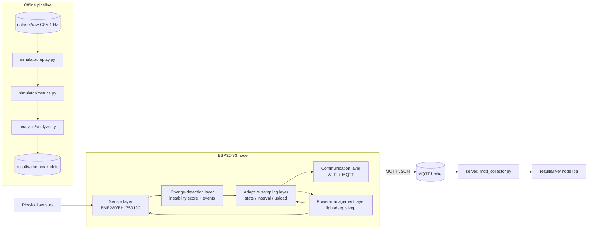

# AdaptiveSense

**Change-Aware Adaptive Sampling for Resource-Constrained IoT Nodes**

A research-oriented IoT project that studies whether a *change-aware* adaptive
sampling policy can reduce sensing and communication overhead on a
resource-constrained device while preserving event-detection performance.

The project is organised as a reproducible experiment system:

- an **offline replay simulator** (Python) evaluates the policy against a common
  1 Hz ground-truth dataset and reports metrics and figures, and
- an **ESP32-S3 firmware** (ESP-IDF, C) runs the same policy on real hardware.

[中文版 README](README_zh.md)

---

## Table of contents

- [Problem](#problem)
- [Research question](#research-question)
- [Method](#method)
- [Architecture](#architecture)
- [Repository layout](#repository-layout)
- [Getting started](#getting-started)
- [Experimental setup](#experimental-setup)
- [Results](#results)
- [Limitations](#limitations)
- [Future work](#future-work)
- [License](#license)

---

## Problem

Environmental IoT nodes sample and transmit sensor data continuously. In many
deployments the environment is stable for long periods; sampling and sending at
a fixed high rate wastes energy, radio air-time, and battery life, while a
fixed low rate risks missing events. A sampling policy that adapts to the
dynamics of the environment could in principle lower the average cost without
losing the ability to detect change.

## Research question

> Can change-aware adaptive sampling reduce sensing and communication overhead
> on resource-constrained IoT devices while preserving event-detection
> performance?

The project does not implement a trivial "change the delay" demo. It builds a
complete experimental system around this question: a configurable adaptive
policy, fixed-rate baselines, a shared ground-truth replay simulator, a metric
suite, and an ESP32-S3 implementation of the identical policy.

## Method

The policy (`simulator/adaptive.py`, mirrored in `firmware/`) is driven by a
per-channel **instability score** and a three-state machine:

1. Each reading produces a normalised score per channel, defined as the maximum
   over three change indicators, each divided by that channel's noise floor:

   - deviation from a persistent EMA baseline,
   - rolling window standard deviation,
   - recent rate of change.

2. A **STABLE / ACTIVE / ALERT** state machine with relative hysteresis picks
   the next sampling interval from a per-state interval ladder
   (20 → 40 → 60 s in STABLE, 60 → 30 → 15 → 5 s in ACTIVE, 5 s in ALERT).

3. An upload policy decides which samples are transmitted (event onset, state
   change, interval change, heartbeat, or large delta since the last upload).

4. Events are declared from the same score, debounced over a minimum duration.

All thresholds and parameters live in
[`experiments/experiment_config.yaml`](experiments/experiment_config.yaml)
(Python) and are mirrored in the firmware configuration. No tuning value is
hardcoded in code. The same event definition is applied to the full-resolution
ground truth and to the sampled readings, so the ground truth is never tuned to
favour one strategy.

Full details: [docs/methodology.md](docs/methodology.md).

## Architecture



The firmware is split into independent layers with clear interfaces:
`sensor`, `change_detector`, `adaptive_scheduler`, `communication`,
`power_mgmt` ([docs/architecture.md](docs/architecture.md)). The adaptive
scheduler holds no reference to any sensor or radio driver, and deep-sleep
support is decoupled from the scheduling policy.

## Repository layout

```
AdaptiveSense/
├── firmware/       ESP-IDF C application (ESP32-S3)
├── server/         MQTT data collector (Python)
├── simulator/      offline replay simulator (Python)
├── experiments/    central experiment config (YAML)
├── analysis/       metrics tables + figures
├── dataset/        ground-truth datasets + generator
├── tests/          unit tests
├── results/        simulation outputs (metrics + plots)
└── docs/           methodology & engineering docs
```

## Getting started

Requirements: Python 3.10+ (Linux / macOS). The firmware additionally requires
ESP-IDF v5.x — see [docs/hardware.md](docs/hardware.md).

```bash
# 1. Python environment
python3 -m venv .venv
source .venv/bin/activate
pip install -r requirements.txt

# 2. (optional) regenerate the synthetic ground-truth datasets
python dataset/generate_dataset.py

# 3. run the unit tests
python -m pytest tests/

# 4. run the analysis pipeline (replays all strategies -> metrics + figures)
python analysis/analyze.py
```

Produced figures (results/plots/):

- `sampling_count.png`
- `communication_reduction.png`
- `event_detection.png`
- `detection_latency.png`
- `accuracy_efficiency_tradeoff.png`

## Experimental setup

Three scenarios are defined on synthetic 1 Hz ground truth
([dataset/README.md](dataset/README.md),
[docs/experiment_protocol.md](docs/experiment_protocol.md)):

| scenario | content | tests |
|----------|---------|-------|
| A — stable | long stable conditions | whether AdaptiveSense reduces sampling/communication when nothing happens |
| B — sudden | abrupt, clearly marked environmental change | event detection and detection latency |
| C — mixed | stable, small change, sudden change, recovery | realistic mixed workload |

Every strategy is replayed over **the same** ground-truth files:

- Fixed-5s, Fixed-10s, Fixed-20s, Fixed-40s, Fixed-60s (baselines)
- AdaptiveSense (MIN 5 s / DEFAULT 20 s / MAX 60 s)

## Results

> Status: **simulation results only** — produced by `analysis/analyze.py` on the
> synthetic ground-truth datasets. **Hardware / on-device results: `Not measured
> yet.`** Real measurements, when available, will be stored separately and will
> never be mixed with these numbers (see [results/README.md](results/README.md)
> and [docs/experiment_protocol.md](docs/experiment_protocol.md)).

### Simulation result — strategy summary (averaged over the 3 scenarios)

| strategy | samples | uploads | communication reduction | avg interval | event detection rate | missed | false positives | avg latency |
|----------|--------:|--------:|------------------------:|-------------:|---------------------:|-------:|----------------:|------------:|
| Fixed-5s | 1080 | 1080 | 80.0 % | 5.0 s | 66.7 % | 0 | 0 | 1.2 s |
| Fixed-10s | 540 | 540 | 90.0 % | 10.0 s | 66.7 % | 0 | 0.3 | 4.5 s |
| Fixed-20s | 270 | 270 | 95.0 % | 20.0 s | 66.7 % | 0 | 1.0 | 7.8 s |
| Fixed-40s | 135 | 135 | 97.5 % | 40.0 s | 66.7 % | 0 | 0.7 | 14.5 s |
| Fixed-60s | 90 | 90 | 98.3 % | 60.0 s | 50.0 % | 0.3 | 0.7 | 28.0 s |
| **AdaptiveSense** | **123** | **102** | **98.0 %** | **41.5 s** | **66.7 %** | **0** | **0** | **21.2 s** |

Ground-truth events exist only in scenarios B and C (2 per scenario; scenario A
has none), so the averaged rates above are dominated by those scenarios.

Interpretation (as it emerges from the simulation data):

- Across the three scenarios, **AdaptiveSense** transmits about **98 % fewer
  packets than the full 1 Hz stream** (≈102 uploads per 5 400 s vs 5 400), the
  same order as the most aggressive baseline Fixed-60s.
- At that transmission budget it keeps **full event detection within the
  scenarios** (0 missed, 0 false positives), whereas Fixed-60s — the only
  baseline with a similar transmission count — misses an event in the mixed
  scenario (66.7 % → 50 % average detection rate).
- Fixed-5s/Fixed-10s get the lowest latency but cost 5–10× more uploads.
  The per-scenario trade-off is visible in
  [results/plots/accuracy_efficiency_tradeoff.png](results/plots/accuracy_efficiency_tradeoff.png).

All raw numbers are in
[results/metrics_all.csv](results/metrics_all.csv) and
[results/metrics_summary.csv](results/metrics_summary.csv).

#### Energy

The `energy_proxy_mj` (= uploads × configurable constant) metric is an
**estimated / proxy** figure, not a real power measurement. With the
configuration constant of 1.0 mJ/upload, AdaptiveSense scores ≈102 mJ per
5 400 s run vs ≈1 080 mJ for Fixed-5s — a proportional proxy that scales
linearly with the reduced transmit count. Real energy must be measured with a
power monitor on hardware; see [docs/power_management.md](docs/power_management.md)
and [docs/hardware.md](docs/hardware.md).

## Limitations

- The quantitative results above are **simulation results on synthetic
  ground truth**; they are indicative, not measurements.
- Detection latency for AdaptiveSense in scenario B is 26 s (identical to
  Fixed-60s): the change-aware policy only accelerates after it observes change,
  and the onset in that scenario occurs shortly after a scheduled sample. This
  is visible in the per-scenario table in `results/metrics_all.csv`.
- Energy figures are proxies; no real power measurements exist yet.
- Only a single node and a single (indoor-like) synthetic workload family have
  been exercised; generalisation to other environments is untested.
- The ground-truth datasets are synthetic; they were designed to be
  reproducible and cover the three scenarios, not to represent a particular
  physical deployment.

## Future work

- TinyML-based adaptive sensing (learned change detection instead of fixed
  thresholds)
- LoRa communication as a low-power transport alternative
- Multi-node sensor network (spatial/temporal correlation between nodes)
- Edge-cloud collaborative inference
- Battery-aware scheduling (energy-state-aware policy)
- Federated learning over the fleet of nodes

## License

[MIT](LICENSE)