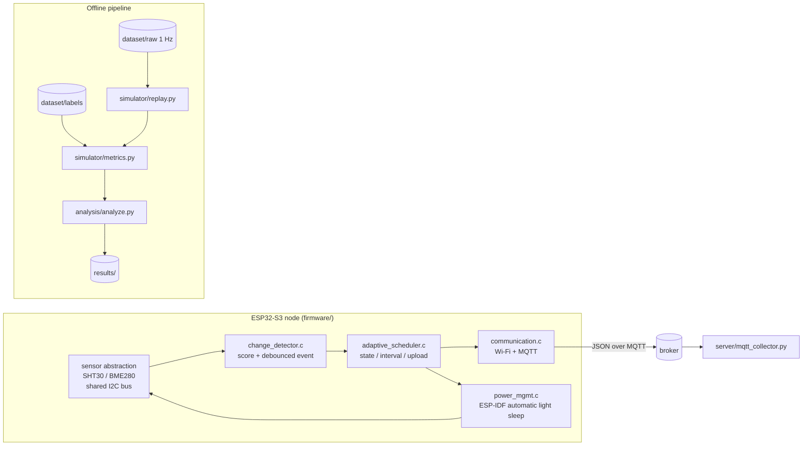

# AdaptiveSense

**Change-aware adaptive sampling for resource-constrained IoT nodes**

[](https://github.com/Sver0411/AdaptiveSense/actions/workflows/python-tests.yml)
[](https://github.com/Sver0411/AdaptiveSense/actions/workflows/esp-idf-build.yml)

An ESP32-S3 / ESP-IDF research prototype that asks whether a *change-aware*
sampling policy can cut sensing and communication cost on a battery-powered
environmental node **without giving up event detection** — and that reports where
the answer is "not entirely".

The policy is implemented twice: an **offline replay simulator** (Python) that
evaluates it against fixed-rate baselines on a labelled synthetic benchmark, and
an **ESP32-S3 firmware** (ESP-IDF v5.4, C) that runs it on device. Both follow one
written specification, and a test compiles the firmware's policy sources for the
host and checks that the two agree decision by decision.

[中文版 README](README_zh.md) · [Algorithm specification](docs/change_score_spec.md) · [Engineering audit](docs/audit_v0.2.md)

---

## Research question

> Can change-aware adaptive sampling reduce sensing and communication overhead on
> resource-constrained IoT devices while preserving event-detection performance?

## Why adaptive sampling

An environmental node that reports every second wastes energy whenever nothing is
happening, which for an indoor room is most of the time. "Sample less and send
less" is the obvious answer; the problem is that "less" is exactly what makes a
node blind. With a fixed 60 s period, a 26 s disturbance can fall entirely between
two samples — scenario E below does exactly that.

A change-aware policy spends its budget where it is useful: rarely while the
environment is quiet, quickly while something is happening. This repository
measures how much that buys, and where it fails.

## System

```
WAKE → READ SENSOR (through the sensor abstraction) → SCORE CHANGE
     → ADAPTIVE POLICY (state, next interval, upload decision)
     → PUBLISH over MQTT if requested → IDLE until the next sample

The sensor layer is an abstraction with two backends behind it:

```
sensor abstraction  (sensor.c: API, read contract, shared I2C bus)
├── SHT30 / SHT3x     temperature + humidity      <- this physical build
└── BME280            temperature + humidity + pressure
```
```



| layer | file | responsibility |
|-------|------|----------------|
| sensor | `sensor.c`, `sensor_supervisor.c`, `bme280_math.c` | I2C transport, forced-mode conversion, bring-up retry policy, Bosch compensation maths |
| change detection | `change_detector.c` | normalised instability score + debounced event |
| adaptive policy | `adaptive_scheduler.c` | state machine, interval ladder, upload decision |
| communication | `communication.c`, `communication_payload.c` | Wi-Fi lifecycle, MQTT publish, payload format, publish counters |
| power | `power_mgmt.c` | ESP-IDF power-management setup, idle, observed sleep statistics |
| configuration | `policy_config.c`, `config_include.h` | `config.h` macros → runtime structs |

The layers have no back-references to each other, and the policy holds no
reference to any sensor or radio driver — which is what lets the same C files be
compiled and run on a workstation for the parity tests.

## Method

The normative definition is [docs/change_score_spec.md](docs/change_score_spec.md).
In short:

1. **Per-channel instability score.** Three change indicators per sample, each
   divided by that channel's noise floor: deviation from a persistent EMA baseline
   (`dev`), population standard deviation over `variety_window_s` (`std`), and
   **mean** `|dx/dt|` over `roc_window_s` (`roc`).
   `score_c = max(dev, std, roc) / noise_floor_c`; the overall score is the
   maximum over participating channels.

2. **Three-state machine with hysteresis** (`STABLE → ACTIVE → ALERT`).
   Escalation is immediate — a score far above the ACTIVE entry bound takes
   STABLE straight to ALERT. De-escalation moves **one level at a time**, and only
   after the score drops below the current state's retention bound, so an ALERT is
   not abandoned (and the node does not fall back to its longest interval) while
   change is still present.

3. **Interval ladders.** STABLE `[20, 40, 60]` s, ACTIVE `[15, 10, 5]` s,
   ALERT `[5]` s: STABLE lengthens as nothing happens, ACTIVE shortens as soon as
   something does.

4. **Upload policy.** Transmit on the first sample, on event onset, on a state
   change, on an interval change, on a heartbeat, or when a channel has moved by
   more than `delta_threshold` noise floors since the last upload request.

5. **Events** are declared when the score stays above `event_threshold` for
   `event_min_duration_s`.

Every value lives in
[`experiments/experiment_config.yaml`](experiments/experiment_config.yaml) and is
mirrored into [`firmware/main/config.example.h`](firmware/main/config.example.h);
`scripts/check_config_parity.py` fails if the two disagree, and it runs in CI. No
tuning value is hardcoded in any source file.

### On-device implementation notes

- **BME280 in forced mode.** One bounded conversion per sample, with a status poll
  and a hard timeout; the sensor is never left converting while the MCU sleeps.
  Calibration parsing and compensation use the vendor's double-precision
  equations, reproduced in `bme280_math.c` and unit-tested on the host.
- **Sleeping goes through the ESP-IDF power manager.** The node idles with
  `vTaskDelay()`; FreeRTOS tickless idle and `esp_pm_configure()` put the chip into
  light sleep, and the Wi-Fi driver's PM locks take part in the decision. The
  application never calls `esp_light_sleep_start()`. See
  [docs/power_management.md](docs/power_management.md).
- **AdaptiveSense is sensor-agnostic.** The sensor layer supports two backends
  behind one interface and one shared I2C bus, selected by configuration: a
  **BME280** (temperature, humidity, **pressure**) and an **SHT30/SHT3x**
  (temperature, humidity). Nothing above the sensor layer — change detector,
  scheduler, event logic, simulator — knows which is in use, because a backend
  reports the channels it cannot measure as *invalid* and the detector already
  ignores invalid channels. The physical build validated here runs an SHT30; the
  published simulation results are unaffected by the choice.
- **No light sensor driver ships.** The synthetic benchmark includes a light
  channel to exercise multi-modal behaviour, but the firmware reports it invalid
  and the MQTT payload sends `"light": null` plus an explicit `valid` map rather
  than a plausible `0`. The same applies to `pressure` on an SHT30 build. A BH1750
  driver is a future hardware extension.

## Experimental design

Seven synthetic scenarios, 26 400 s of 1 Hz signal
([dataset/README.md](dataset/README.md)):

| id | scenario | duration | injected content | designed to expose |
|----|----------|----------|------------------|--------------------|
| A | stable | 2 h | nothing | cost when nothing happens |
| B | sudden | 30 min | one abrupt +5 °C step, onset off every sampling grid | step detection and latency |
| C | mixed | 2 h | sub-threshold wobble, step up, step down | a realistic mixed workload |
| D | repeated | 1 h | 6 irregular steps + 2 light bursts | repeated detection, a second modality |
| E | short event | 30 min | one **26 s** spike after 26 min of quiet | **a short event missed by a long interval** |
| F | noisy stable | 20 min | nothing, noise ≈ 7× the configured temperature floor | **false positives under a mis-parameterised floor** |
| G | slow drift | 1 h | +3 °C over 30 min, hold, return | **change slower than the baseline** |

The benchmark contains **24 channel-level labels derived from 13 injected physical
disturbances**. A single physical disturbance may create labels on more than one
sensor channel, because the generator couples humidity to temperature; the
generator prints both counts and `tests/test_events.py` asserts both.

Every strategy is replayed over **the same** signal: fixed-rate baselines
(Fixed-5s/10s/20s/40s/60s) and AdaptiveSense (MIN 5 s / DEFAULT 20 s / MAX 60 s).

**The ground truth is independent of AdaptiveSense.** Labels are written by the
dataset generator from its own noise-free driven signal, using an absolute
per-channel rule, so the policy cannot influence what counts as an event; see
[docs/methodology.md](docs/methodology.md).

### What the detection numbers mean

> Event-detection metrics in this benchmark evaluate **event information retained
> in each sampled stream**, using a shared offline per-channel detector.
>
> They are **not** direct accuracy measurements of the firmware's global
> `event_active` flag. The firmware flag is used for online scheduling and upload
> decisions; the offline detector exists so that every sampling strategy is scored
> by the same mechanism.
>
> The metric is therefore a *sampling-quality* metric — how much of the
> environmental event structure survives in the samples a strategy chose to take —
> which is the question this project is actually about. See
> [docs/change_score_spec.md](docs/change_score_spec.md) for both quantities
> defined side by side.

Detection is scored by one-to-one, channel-aware matching: a detection matches at
most one labelled event and vice versa; matched pairs give the latency
(onset-to-onset, clamped at 0); leftovers on the label side are missed events, and
leftovers on the detection side are false positives. Detection rate and latency for
the headline table are **micro-aggregated** (pooled counts), never the mean of
per-scenario rates.

## Simulation results

> **Synthetic simulation results** — produced by `analysis/analyze.py` on the
> synthetic benchmark. These are not hardware measurements.

### Overall, micro-aggregated over all seven scenarios

| strategy | samples | uploads | application upload reduction | mean interval | labels | detected | missed | false positives | false alarms | detection rate | mean latency | p95 latency |
|----------|--------:|--------:|-----------------------------:|--------------:|-------:|---------:|-------:|----------------:|-------------:|---------------:|-------------:|------------:|
| Fixed-5s | 5280 | 5280 | 80.0 % | 5.0 s | 24 | 22 | 2 | 17 | 11 | 91.7 % | 12.3 s | 14.0 s |
| Fixed-10s | 2640 | 2640 | 90.0 % | 10.0 s | 24 | 22 | 2 | 20 | 15 | 91.7 % | 17.3 s | 19.0 s |
| Fixed-20s | 1320 | 1320 | 95.0 % | 20.0 s | 24 | 19 | 5 | 20 | 19 | 79.2 % | 35.9 s | 38.1 s |
| Fixed-40s | 660 | 660 | 97.5 % | 40.0 s | 24 | 17 | 7 | 14 | 13 | 70.8 % | 62.9 s | 78.0 s |
| Fixed-60s | 440 | 440 | 98.3 % | 60.0 s | 24 | 11 | 13 | 5 | 3 | 45.8 % | 111.7 s | 118.0 s |
| **AdaptiveSense** | **1178** | **768** | **97.1 %** | **22.3 s** | **24** | **18** | **6** | **17** | **11** | **75.0 %** | **41.2 s** | **67.2 s** |

**`application upload reduction` is an application-level metric, not a radio-traffic
metric.** It is `1 − number_of_application_uploads / number_of_ground_truth_samples`,
and it excludes everything the radio does on its own: Wi-Fi beacon reception, TCP
ACKs, MQTT keepalive PINGREQ/PINGRESP, MQTT protocol overhead, reassociation and
DHCP traffic. A node whose uploads drop by 97 % has **not** reduced total radio
traffic by 97 % — the keepalive alone guarantees background traffic. The same
qualification applies to `upload_energy_proxy`.

`false alarms` counts the false positives that lie inside no same-channel labelled
event. The rest are *redundant* detections: the policy saw one physical event as
more than one rise/fall trigger, which is an artefact of matching a sampled stream
against a continuous disturbance rather than a spurious alarm. Both numbers are in
`results/metrics_all.csv`.

Read as a trade-off, AdaptiveSense sits **between Fixed-20s and Fixed-40s**: 97.1 %
upload reduction at 75.0 % detection, where Fixed-20s gets 95.0 % at 79.2 % and
Fixed-40s 97.5 % at 70.8 %. On this benchmark the change-aware policy interpolates
the fixed-rate trade-off curve rather than beating it.

### Per scenario, AdaptiveSense

| scenario | samples | uploads | labels | detected | missed | rate | mean latency |
|----------|--------:|--------:|-------:|---------:|-------:|-----:|-------------:|
| A stable | 122 | 120 | 0 | 0 | 0 | *N/A* | — |
| B sudden | 115 | 44 | 2 | 2 | 0 | 100 % | 35.5 s |
| C mixed | 239 | 166 | 4 | 2 | 2 | 50 % | 47.5 s |
| D repeated | 389 | 137 | 14 | 14 | 0 | 100 % | 41.1 s |
| E short event | 32 | 30 | 2 | 0 | 2 | 0 % | — |
| F noisy stable | 219 | 211 | 0 | 0 | 0 | *N/A* | — |
| G slow drift | 62 | 60 | 2 | 0 | 2 | 0 % | — |

A scenario with no labelled event reports **N/A**, never 0 %. Five of
AdaptiveSense's 11 false alarms come from scenario F, and every fixed strategy
produces false alarms there too (1–6): the configured noise floor does not
describe that scenario, and the policy is not the cause.

### Where the policy loses

* **E — a 26 s event at a 60 s interval: missed.** No policy acting only on
  sampled observations can react to a change that lies between two samples. This is
  a property of sampled sensing, not a tuning failure.
* **G — slow drift: missed by every strategy, including Fixed-5s.** The deviation
  indicator uses an EMA of time constant `baseline_tau_s = 60 s`. A ramp slower
  than that constant has a steady-state deviation of only `rate × tau`, which never
  reaches the event threshold, so a 3 °C drift over 30 minutes is invisible to the
  score as specified. Detecting drift needs a slower reference or an explicit trend
  term — future work, not a parameter tweak.
* **C — the downward step is missed while the upward step is detected.** A step
  observed at a 60 s interval stays above the threshold for roughly one sampling
  period, because the baseline half-catches-up within `baseline_tau_s`; with
  `event_min_duration_s = 10 s` the debounce cannot be satisfied from a single
  observation. The debounce duration, the baseline time constant and the sampling
  interval are coupled, and the current values do not satisfy that coupling.

Full numbers: [`results/metrics_all.csv`](results/metrics_all.csv) (per scenario)
and [`results/metrics_summary.csv`](results/metrics_summary.csv) (overall).
Figures: `results/plots/`. The pipeline regenerates the figures and CI checks they
were produced; PNG bytes depend on the plotting library build, so byte-identity is
required of the **numeric** outputs only, and CI enforces that.

## Hardware status

| item | status |
|------|--------|
| ESP-IDF build | **Verified** — `idf.py set-target esp32s3 && idf.py build`, ESP-IDF v5.4.4, 0 warnings ([record](docs/build_validation.md)) |
| Python / C policy parity | **Verified** — firmware policy sources compiled for the host and compared sample by sample |
| Synthetic evaluation | **Verified** — numeric outputs reproduce byte for byte |
| Power-management configuration | **Verified in the build** — `CONFIG_PM_ENABLE=y`, tickless idle, light-sleep callbacks; the active sleep mode is logged at boot |
| **ESP32-S3 physical flash / run** | `Not measured yet.` |
| **BME280 physical sensor validation** | `Not measured yet.` |
| **Wi-Fi / MQTT multi-cycle hardware run** | `Not measured yet.` |
| **Power measurement** | `Not measured yet.` — no INA219 / Joulescope / Power Profiler run |
| Sensor layer, both backends | **Verified** — host-tested protocol layer, and the SHT30 read on hardware (see the test log) |
| BH1750 light sensor | **Not implemented**; the channel is reported invalid and sent as `null` |
| Deep sleep | **Experimental, rejected at compile time** — it reboots, so the scheduling state would not survive |

The firmware logs the policy decision (`upload_requested`) and the transport
outcome (`publish_call_ok`) separately, and keeps counters for both, so a hardware
campaign can distinguish "the policy wanted to send" from "the MQTT client took
it". Note that at QoS 0 `publish_call_ok` means *the client accepted the request*,
not that the broker received or delivered the packet.

## Reproduction

Requirements: Python 3.10+; ESP-IDF v5.4 for the firmware; a C compiler for the
host-side tests.

```bash
python3 -m venv .venv && source .venv/bin/activate
pip install -r requirements.txt

python dataset/generate_dataset.py          # raw signals + independent labels
python -m pytest tests/ -v                  # unit, matching, statistics, host-side C
python scripts/check_config_parity.py       # YAML <-> firmware config.h
python analysis/analyze.py                  # metrics + figures
```

Firmware:

```bash
cd firmware
idf.py set-target esp32s3
idf.py build
```

No credentials are needed to build: `firmware/main/CMakeLists.txt` provisions the
git-ignored `config.h` from the committed example.

The generator is seeded and the analysis has no randomness, so the committed
numeric results are exactly what the pipeline produces. CI enforces this with
`git diff --exit-code -- 'dataset/**/*.csv' 'results/**/*.csv'`.

## Limitations

1. **Simulation results on synthetic data.** Indicative, not measurements; 24
   channel-level labels over 26 400 s is a small benchmark.
2. **One environment family and a single node.** Indoor-like temperature,
   humidity, pressure and light; generalisation is untested.
3. **Limited sensor modalities.** Three channels are modelled; only two
   (temperature, humidity) are enabled by default, pressure is disabled and the
   light channel has no driver.
4. **No hardware energy measurement.** All cost figures are counts and a
   dimensionless proxy.
5. **A change-aware policy cannot react before a change has been sampled.** If no
   sample lands inside a short event, nothing that relies on sampled observations
   alone can detect it (scenario E).
6. **Parameters are hand-selected and known not to be jointly optimal.**
   `event_min_duration_s` (10 s) is not comfortably smaller than `baseline_tau_s`
   (60 s), so a step observed at a 60 s interval cannot satisfy the debounce before
   the deviation decays (scenario C). The values were left as they were configured
   rather than tuned to improve the published numbers.
7. **No comparison against more advanced adaptive-sampling algorithms**
   (change-point detection, Bayesian or information-theoretic schemes,
   learning-based predictors).
8. **"Detection" means the score crossed a threshold for long enough**, not that a
   change point was located: the detector is a threshold-and-debounce rule.
9. **`publish_call_ok` is not delivery confirmation.** It reports that the MQTT
   client accepted the request (QoS 0). End-to-end confirmation would need QoS 1,
   `MQTT_EVENT_PUBLISHED` and server-side receipt validation.

## Future work

- **A real-world dataset** collected from the node itself
  ([docs/experiment_protocol.md](docs/experiment_protocol.md)).
- **Hardware energy measurement** (INA219 / Joulescope / Nordic Power Profiler) to
  replace the proxy with joules and to validate the light-sleep duty cycle.
- **A drift-sensitive indicator** — a slower baseline or an explicit trend term —
  so the scenario-G class of change is detectable at all.
- **Joint parameter selection** for `event_min_duration_s`, `baseline_tau_s` and
  the ladders, with the coupling above treated explicitly.
- **Delivery confirmation** via QoS 1 + `MQTT_EVENT_PUBLISHED` + server-side
  receipt validation.
- **BH1750 support**, and with it a real multi-modal on-device build.
- **Comparison against advanced adaptive sampling / change-point detection**, and
  the exploratory directions (a TinyML predictor, LoRa transport, multi-node
  correlation). *None of these are implemented here.*

## Repository layout

```
AdaptiveSense/
├── firmware/       ESP-IDF C application (ESP32-S3)
├── simulator/      offline replay simulator + normative scoring
├── dataset/        synthetic generator, raw signals, independent labels
├── experiments/    central experiment configuration (YAML)
├── analysis/       metrics tables and figures
├── scripts/        configuration parity check
├── tests/          unit tests + host-side C test harnesses
├── results/        simulation outputs (metrics + plots)
└── docs/           specification, methodology, audit, engineering notes
```

## License

AdaptiveSense is [MIT](LICENSE). `firmware/main/bme280_math.c` reproduces the
compensation equations of Bosch Sensortec's `BME280_SensorAPI` under
**BSD-3-Clause**; the full notice is in
[THIRD_PARTY_NOTICES.md](THIRD_PARTY_NOTICES.md) and at the top of that file.
