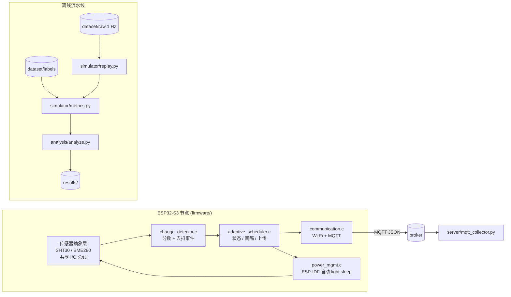

# AdaptiveSense

**面向资源受限 IoT 节点的变化感知自适应采样**

[](https://github.com/Sver0411/AdaptiveSense/actions/workflows/python-tests.yml)
[](https://github.com/Sver0411/AdaptiveSense/actions/workflows/esp-idf-build.yml)

一个基于 ESP32-S3 / ESP-IDF 的研究原型：验证**变化感知（change-aware）**的采样策略
能否在电池供电的环境节点上降低感知与通信开销，同时不牺牲事件检测能力——
并且如实说明**哪些情况下答案是"做不到"**。

同一套策略有两份实现：**离线回放仿真器**（Python，在带独立标注的合成基准上与固定周期
基线对比）与 **ESP32-S3 固件**（ESP-IDF v5.4，C，在真机上运行）。两者遵循**同一份书面
规范**；测试会把固件的策略源码编译到主机上，逐决策比对两者是否一致。

[English README](README.md) · [算法规范](docs/change_score_spec.md) · [工程审计](docs/audit_v0.2.md)

---

## 研究问题

> 变化感知的自适应采样，能否在保持事件检测能力的前提下，
> 降低资源受限 IoT 设备的感知与通信开销？

## 为什么要自适应采样

每秒上报一次的环境节点，在环境没有变化时几乎全程在浪费能量——室内场景大部分时间如此。
"少采、少发"是直觉答案，但问题恰恰在于"少"就是让节点变盲的原因：固定 60 s 周期下，
一个持续 26 s 的扰动可以完全落在两次采样之间（下文场景 E 正是如此）。

变化感知策略把采样预算花在有用的地方：环境安静时稀疏采样，环境变化时快速采样。
本仓库量化这能换来多少收益，以及**它在哪些情况下会失败**。

## 系统

```
唤醒 → 读取传感器（经传感器抽象层）→ 计算变化分数
     → 自适应策略（状态、下一间隔、是否上传）
     → 按需通过 MQTT 上报 → 空闲到下一次采样时刻
```

传感器层是一个抽象，背后有两个后端。本仓库的构建跑在 **SHT30** 上；BME280 是另一个
受支持的后端，编译进哪一个是配置选择——抽象层之上的任何代码都不知道二者的区别。

```
传感器抽象层  (sensor.c：API、读取契约、后端选择)
├── SHT30 / SHT3x     温度 + 湿度            <- 本物理构建
└── BME280            温度 + 湿度 + 气压
```



| 层 | 文件 | 职责 |
|----|------|------|
| 传感器 | `sensor.c`、`sensor_backend.h`、`sensor_bus.c`、`sensor_supervisor.c`、`sensor_sht30.c`、`sht30_proto.c`、`sensor_bme280.c`、`bme280_math.c`、`sensor_bh1750.c`、`bh1750_proto.c` | 传感器 API 与后端选择、共享 I²C 总线归属、初始化与恢复监督、两个芯片后端（SHT30 / BME280）以及可选光照通道 |
| 变化检测 | `change_detector.c` | 归一化不稳定性分数 + 去抖事件 |
| 自适应策略 | `adaptive_scheduler.c` | 状态机、间隔阶梯、上传决策 |
| 通信 | `communication.c`、`communication_payload.c` | Wi-Fi 生命周期、MQTT 上报、负载格式、上报计数 |
| 电源 | `power_mgmt.c` | ESP-IDF 电源管理配置、空闲、可观测的睡眠统计 |
| 配置 | `policy_config.c`、`config_include.h` | `config.h` 宏 → 运行时结构体 |

传感器层细分——一个抽象，两个后端：

| 文件 | 职责 |
|------|------|
| `sensor.c` | 传感器 API、读取契约、后端选择、mock 覆盖 |
| `sensor.h` | 公开读取契约（`sensor_init` / `sensor_read`、逐通道有效性） |
| `sensor_backend.h` | 芯片后端需要实现的接口 |
| `sensor_bus.c` | 唯一的共享 I²C 总线：只创建一次、归它所有，后端绝不自己创建 |
| `sensor_supervisor.c` | 初始化与运行时恢复监督：何时重试、何时判定“不再应答的传感器”不可用并重探 |
| `sensor_sht30.c` | SHT30 / SHT3x 后端：把协议绑到真实总线上，串起一次测量 |
| `sht30_proto.c` | 纯 C 的 SHT30 协议：CRC-8、帧解码、命令时序 |
| `sensor_bme280.c` | BME280 后端：芯片 ID 校验、forced 模式寄存器时序 |
| `bme280_math.c` | BME280 校准参数解析与补偿算法（纯 C） |
| `sensor_bh1750.c` | 可选光照通道：共享总线上的 BH1750，自带轻量可用性状态 |
| `bh1750_proto.c` | 纯 C 的 BH1750 协议：单次转换、raw→lux，以及可用性策略 |

各层之间没有反向依赖；策略层不引用任何传感器或无线驱动——这正是同一份 C 文件能够在
主机上编译并参与一致性测试的原因。

## 方法

完整规范见 [`docs/change_score_spec.md`](docs/change_score_spec.md)，要点：

1. **逐通道不稳定性分数**。每次采样计算三个变化指标，各自除以该通道的噪声底线：
   与持久 EMA 基线的偏差（`dev`）、`variety_window_s` 窗口内的总体标准差（`std`）、
   `roc_window_s` 窗口内 `|dx/dt|` 的**均值**（`roc`）。
   `score_c = max(dev, std, roc) / noise_floor_c`；总分取参与通道的最大值。

2. **带迟滞的三态状态机**（`STABLE → ACTIVE → ALERT`）。
   **升级立即发生**——分数远超 ACTIVE 进入阈值时，STABLE 可直接跳到 ALERT；
   **降级一次只降一级**，且必须等分数跌破当前状态的**保持阈值**，
   因此在环境仍在变化时不会草率离开 ALERT、退回最长采样间隔。

3. **间隔阶梯**：STABLE `[20, 40, 60]` s、ACTIVE `[15, 10, 5]` s、ALERT `[5]` s。
   无事时 STABLE 变长，有事时 ACTIVE 立即变短。

4. **上传策略**：首次采样、事件起始、状态变化、间隔变化、心跳超时，
   或任一通道相对上次上传的偏移超过 `delta_threshold` 个噪声底线时上报。

5. **事件判定**：分数连续高于 `event_threshold` 达到 `event_min_duration_s` 即声明事件。

所有取值都在
[`experiments/experiment_config.yaml`](experiments/experiment_config.yaml)，
并镜像到 [`firmware/main/config.example.h`](firmware/main/config.example.h)；
`scripts/check_config_parity.py` 会在两者不一致时失败，CI 会运行它。
任何源码里都没有硬编码的可调参数。

### 真机实现要点

- **BME280 forced 模式**：每次采样一次有界转换，轮询状态位并有硬超时；
  MCU 睡眠期间传感器绝不停留在转换状态。标定解析与补偿使用厂商双精度公式，
  放在 `bme280_math.c` 并在主机上做单元测试。
- **睡眠走 ESP-IDF 电源管理**：节点用 `vTaskDelay()` 空闲，由 FreeRTOS tickless idle 与
  `esp_pm_configure()` 让芯片进入 light sleep，Wi-Fi 驱动的 PM 锁参与决策。
  应用层**从不**调用 `esp_light_sleep_start()`。详见
  [docs/power_management.md](docs/power_management.md)。
- **AdaptiveSense 是 sensor-agnostic（传感器无关）的**：传感层在同一接口与同一条共享
  I²C 总线之后支持两种后端，由配置选择：**BME280**（温度、湿度、**气压**）与
  **SHT30/SHT3x**（温度、湿度）。传感层以上——变化检测、调度器、事件逻辑、仿真器——
  都不知道当前用的是哪一个，因为后端会把无法测量的通道标记为**无效**，
  而检测器本来就会忽略无效通道。本次真机验证使用 SHT30；
  已发布的仿真结果不受该选择影响。
- **光照通道在真机上是真实的，且是可选的**：共享总线上的 BH1750 / GY-302 提供 `light`；
  本物理构建中 SHT30 提供温湿度、BH1750 提供光照，`pressure` 保持无效（板上没有器件测量它）。
  它是**可选通道**而非第三个 backend：光照传感器失效或被拔掉时，只有 `light` 变无效、
  整次测量仍然成功——一个负责上报温湿度的节点，不该因为一个可以没有的通道而停摆。
  不可用的通道仍然以 `null` 加显式 `valid` 映射发送，而不是一个看起来合理的 `0`。
- **仿真光照通道与真机光照通道是两回事**：合成基准里的光照是生成的信号、由仿真器回放；
  [仿真结果](#仿真结果) 中的数字与 BH1750 无关，既不支持也不反对它。真机验证的是
  "真实光照通道能进入检测器且策略会对它作出反应"，而**不是**"已公布的检出率在该传感器上成立"。
  

## 实验设计

7 个合成场景，共 26 400 s 的 1 Hz 信号（[dataset/README.md](dataset/README.md)）：

| 编号 | 场景 | 时长 | 注入内容 | 用于暴露 |
|------|------|------|----------|----------|
| A | stable | 2 h | 无 | 无事时的开销 |
| B | sudden | 30 min | 一次 +5 °C 阶跃，起始点避开所有采样网格 | 阶跃检测与延迟 |
| C | mixed | 2 h | 阈值以下抖动、上升阶跃、下降阶跃 | 真实混合负载 |
| D | repeated | 1 h | 6 次不规则阶跃 + 2 次光扰动 | 重复检测、第二模态 |
| E | short event | 30 min | 26 min 平静后出现一次 **26 s** 尖峰 | **长间隔漏掉短事件** |
| F | noisy stable | 20 min | 无事件，噪声约为配置温度噪声底线的 7 倍 | **噪声底线不匹配时的误报** |
| G | slow drift | 1 h | 30 min 内 +3 °C，保持后返回 | **比基线更慢的变化** |

基准包含 **13 次注入的物理扰动，产生 24 个通道级标签**。由于生成器把湿度与温度耦合，
一次物理扰动可能在多个传感器通道上产生标签；生成器会同时打印两个计数，
`tests/test_events.py` 对二者都做了断言。

所有策略都在**同一份信号**上回放：固定周期基线（Fixed-5s/10s/20s/40s/60s）与
AdaptiveSense（MIN 5 s / DEFAULT 20 s / MAX 60 s）。

**真值与 AdaptiveSense 完全独立。** 标签由数据集生成器依据其自身的**无噪声驱动信号**、
以绝对物理量规则写出，策略无法影响"什么算事件"；详见
[docs/methodology.md](docs/methodology.md)。

### 检测指标的含义

> 本基准中的事件检测指标评估的是**每条采样流中保留了多少事件信息**，
> 使用同一套离线逐通道检测器。
>
> 它们**不是**固件全局 `event_active` 标志的准确率测量。固件标志用于在线调度与上传决策；
> 离线检测器的存在是为了让所有采样策略使用同一评价机制。
>
> 因此这是一个**采样质量（sampling-quality）指标**——一个策略主动抽取的样本里保留了
> 多少环境事件结构——这正是本项目真正关心的问题。两个量在
> [docs/change_score_spec.md](docs/change_score_spec.md) 中并列定义。

检测采用通道感知的一对一匹配：一个检测最多匹配一个标注事件，反之亦然；匹配对给出延迟
（起始到起始，下限截断为 0）；标签侧剩余计为漏检，检测侧剩余计为误报。
总体表格中的检测率与延迟使用 **micro 聚合**（汇总计数），而不是对各场景比率取平均。

## 仿真结果

> **合成仿真结果**——由 `analysis/analyze.py` 在合成基准上产生。**不是**硬件测量。

### 总体（跨 7 个场景 micro 聚合）

| 策略 | 采样数 | 上传数 | 应用层上传降低 | 平均间隔 | 标签 | 检出 | 漏检 | 误报 | 其中真正误报 | 检测率 | 平均延迟 | p95 延迟 |
|------|-------:|-------:|---------------:|---------:|-----:|-----:|-----:|-----:|-------------:|-------:|---------:|---------:|
| Fixed-5s | 5280 | 5280 | 80.0 % | 5.0 s | 24 | 22 | 2 | 17 | 11 | 91.7 % | 12.3 s | 14.0 s |
| Fixed-10s | 2640 | 2640 | 90.0 % | 10.0 s | 24 | 22 | 2 | 20 | 15 | 91.7 % | 17.3 s | 19.0 s |
| Fixed-20s | 1320 | 1320 | 95.0 % | 20.0 s | 24 | 19 | 5 | 20 | 19 | 79.2 % | 35.9 s | 38.1 s |
| Fixed-40s | 660 | 660 | 97.5 % | 40.0 s | 24 | 17 | 7 | 14 | 13 | 70.8 % | 62.9 s | 78.0 s |
| Fixed-60s | 440 | 440 | 98.3 % | 60.0 s | 24 | 11 | 13 | 5 | 3 | 45.8 % | 111.7 s | 118.0 s |
| **AdaptiveSense** | **1178** | **768** | **97.1 %** | **22.3 s** | **24** | **18** | **6** | **17** | **11** | **75.0 %** | **41.2 s** | **67.2 s** |

**「应用层上传降低」是应用层指标，不是无线流量指标。**
它等于 `1 − number_of_application_uploads / number_of_ground_truth_samples`，
**不包含**无线链路自身的开销：Wi-Fi beacon 接收、TCP ACK、MQTT keepalive
（PINGREQ/PINGRESP）、MQTT 协议开销、重新关联与 DHCP 流量。
上传数降低 97 % **不等于**无线总流量降低 97 %——仅 keepalive 就保证了背景流量。
`upload_energy_proxy` 同理。

「其中真正误报」= 不落在任何同通道标注事件区间内的误报。其余属于**冗余检测**：
策略把一次物理事件看成多次上升/下降触发，这是"用采样流匹配连续扰动"的产物，
而非无中生有的告警。两个数字都在 `results/metrics_all.csv`。

从权衡角度看，AdaptiveSense 落在 **Fixed-20s 与 Fixed-40s 之间**：
97.1 % 上传降低对应 75.0 % 检测率，而 Fixed-20s 是 95.0 % / 79.2 %、
Fixed-40s 是 97.5 % / 70.8 %。在本基准上，变化感知策略是在**插值**固定率的权衡曲线，
而不是超越它。

### 逐场景（AdaptiveSense）

| 场景 | 采样数 | 上传数 | 标签 | 检出 | 漏检 | 检测率 | 平均延迟 |
|------|-------:|-------:|-----:|-----:|-----:|-------:|---------:|
| A stable | 122 | 120 | 0 | 0 | 0 | *N/A* | — |
| B sudden | 115 | 44 | 2 | 2 | 0 | 100 % | 35.5 s |
| C mixed | 239 | 166 | 4 | 2 | 2 | 50 % | 47.5 s |
| D repeated | 389 | 137 | 14 | 14 | 0 | 100 % | 41.1 s |
| E short event | 32 | 30 | 2 | 0 | 2 | 0 % | — |
| F noisy stable | 219 | 211 | 0 | 0 | 0 | *N/A* | — |
| G slow drift | 62 | 60 | 2 | 0 | 2 | 0 % | — |

无标注事件的场景报告 **N/A**，而不是 0 %。AdaptiveSense 的 11 次真正误报中有 5 次来自
场景 F，而所有固定策略在那里同样产生误报（1–6 次）：是配置的噪声底线无法描述该场景，
并非策略本身的问题。

### 策略失败的地方

* **E —— 26 s 事件落在 60 s 间隔里：漏检。** 任何只依据**已采到的观测**做决策的策略，
  都不可能对发生在两次采样之间的变化做出反应。这是采样式感知的固有性质，不是调参失败。
* **G —— 慢漂移：包括 Fixed-5s 在内所有策略全部漏检。** 偏差指标与时间常数
  `baseline_tau_s = 60 s` 的 EMA 比较；比该常数更慢的斜坡，其稳态偏差只有 `速率 × tau`，
  永远达不到事件阈值，因此 30 min 内 3 °C 的漂移对本规范下的分数是不可见的。
  要检测漂移需要更慢的参考基线或显式趋势项——是后续工作，不是改一个参数。
* **C —— 下降阶跃漏检，上升阶跃被检出。** 在 60 s 间隔下观测到的阶跃只有一个采样周期
  左右的可见窗口（基线在一个 `baseline_tau_s` 内追上近一半）；而
  `event_min_duration_s = 10 s` 的去抖无法由单次观测满足。
  去抖时长、基线时间常数与采样间隔是**相互耦合**的，当前取值不满足该耦合。

完整数据：[`results/metrics_all.csv`](results/metrics_all.csv)（逐场景）、
[`results/metrics_summary.csv`](results/metrics_summary.csv)（总体）；
图表：`results/plots/`。图表由流水线重新生成，CI 校验"已生成"；PNG 字节取决于绘图库构建，
因此逐字节一致只对**数值输出**作要求，并由 CI 强制。

## 硬件状态

| 项目 | 状态 |
|------|------|
| ESP-IDF 构建 | **已验证** —— `idf.py set-target esp32s3 && idf.py build`，ESP-IDF v5.4.4，0 警告（[记录](docs/build_validation.md)） |
| Python / C 策略一致性 | **已验证** —— 固件策略源码在主机编译并逐样本比对 |
| 合成评估 | **已验证** —— 数值输出可逐字节复现 |
| 电源管理配置 | **构建中已验证** —— `CONFIG_PM_ENABLE=y`、tickless idle、light-sleep 回调；启动日志会打印生效的睡眠模式 |
| **ESP32-S3 真机烧录 / 运行** | **已验证** —— 见 `docs/hardware_test_log.md`（Session 1–7） |
| **BME280 实机传感器验证** | `Not measured yet.` —— 板上没有 BME280；驱动有主机测试、芯片 ID 校验已写好，但从未见过实物 |
| **Wi-Fi / MQTT 多周期真机运行** | **已验证** —— 手机热点 + 本机 broker 的多周期运行，节点上报与收集端已交叉核对 |
| **功耗测量** | `Not measured yet.` —— 未做 INA219 / Joulescope / Power Profiler 测量 |
| BH1750 光照传感器 | **已接入**：共享 I²C，单次 H 分辨率，提供真实 lux；失效时仅该通道无效 |
| Deep sleep | **实验性，编译期拒绝** —— 会重启，调度状态无法存活 |

固件分别记录策略决策（`upload_requested`）与传输结果（`publish_call_ok`）并维护计数，
便于真机实验区分"策略决定要发"与"MQTT 客户端接受了"。
注意：在 QoS 0 下 `publish_call_ok` 的含义是*客户端接受了请求*，
**不是** broker 已收到或已投递。

## 复现

依赖：Python 3.10+；固件需要 ESP-IDF v5.4；主机侧测试需要一个 C 编译器。

```bash
python3 -m venv .venv && source .venv/bin/activate
pip install -r requirements.txt

python dataset/generate_dataset.py          # 原始信号 + 独立标签
python -m pytest tests/ -v                  # 单元、匹配、统计、主机侧 C 测试
python scripts/check_config_parity.py       # YAML <-> 固件 config.h
python analysis/analyze.py                  # 指标 + 图表
```

固件：

```bash
cd firmware
idf.py set-target esp32s3
idf.py build
```

构建不需要任何凭据：`firmware/main/CMakeLists.txt` 会在 `config.h`（被 git 忽略）
缺失时从提交的示例文件生成。

生成器带种子、分析无随机性，因此已提交的数值结果就是流水线的输出。
CI 用 `git diff --exit-code -- 'dataset/**/*.csv' 'results/**/*.csv'` 强制这一点。

## 局限

1. **合成数据上的仿真结果**，仅供参考而非测量；26 400 s 上 24 个通道级标签是小基准。
2. **单一环境族与单节点**：类室内的温湿压光，泛化性未验证。
3. **传感模态有限**：建模了 3 个通道，默认只启用 2 个（温度、湿度），气压被禁用，
   光照通道由 BH1750 提供（详见硬件状态）。
4. **没有真机能量测量**：所有成本量都是计数与无量纲代理量。
5. **变化感知策略无法在变化被采到之前做出反应**。若短事件期间没有采样点，
   任何仅依赖采样观测的策略都无法检出（场景 E）。
6. **参数是人工选定的，且已知并非联合最优。**
   `event_min_duration_s`（10 s）并未显著小于 `baseline_tau_s`（60 s），
   导致在 60 s 间隔下观测到的阶跃无法在偏差衰减前满足去抖（场景 C）。
   这些取值**按原配置保留，没有为了改善已发布数字而调参**。
7. **没有与更先进的自适应采样算法对比**（变点检测、贝叶斯或信息论方法、学习式预测器）。
8. **"检出"意味着"分数越过阈值并保持足够久"**，而不是"变点被正确定位"：
   检测器是阈值 + 去抖规则。
9. **`publish_call_ok` 不等于投递确认**：它只表示 MQTT 客户端接受了请求（QoS 0）。
   端到端确认需要 QoS 1、`MQTT_EVENT_PUBLISHED` 与服务端回执校验。

## 后续工作

- **真实数据集**：按 [docs/experiment_protocol.md](docs/experiment_protocol.md)
  从节点本身采集。
- **真机能量测量**（INA219 / Joulescope / Nordic Power Profiler），把代理量变成焦耳，
  并验证 light sleep 占空比。
- **对漂移敏感的指标**——更慢的基线或显式趋势项——使场景 G 一类变化至少可被检出。
- **`event_min_duration_s`、`baseline_tau_s` 与阶梯的联合选参**，显式处理上述耦合。
- **投递确认**：QoS 1 + `MQTT_EVENT_PUBLISHED` + 服务端回执校验。
- ~~BH1750 支持~~ —— 已完成：BH1750 已接入并验证，真机已是温湿度 + 光照的双模态构建。
- **与更先进的自适应采样 / 变点检测方法对比**，以及探索性方向（TinyML 预测器、
  LoRa 传输、多节点相关性）。*这些均未在本仓库实现。*

## 仓库结构

```
AdaptiveSense/
├── firmware/       ESP-IDF C 应用（ESP32-S3）
├── simulator/      离线回放仿真器 + 规范算法实现
├── dataset/        合成生成器、原始信号、独立标签
├── experiments/    中心实验配置（YAML）
├── analysis/       指标表与图表
├── scripts/        配置一致性检查
├── tests/          单元测试 + 主机侧 C 测试驱动
├── results/        仿真输出（指标 + 图表）
└── docs/           规范、方法学、审计与工程说明
```

## 许可证

AdaptiveSense 采用 [MIT](LICENSE)。`firmware/main/bme280_math.c` 复现了
Bosch Sensortec `BME280_SensorAPI` 的补偿公式，采用 **BSD-3-Clause**；
完整声明见 [THIRD_PARTY_NOTICES.md](THIRD_PARTY_NOTICES.md) 与该文件顶部。
