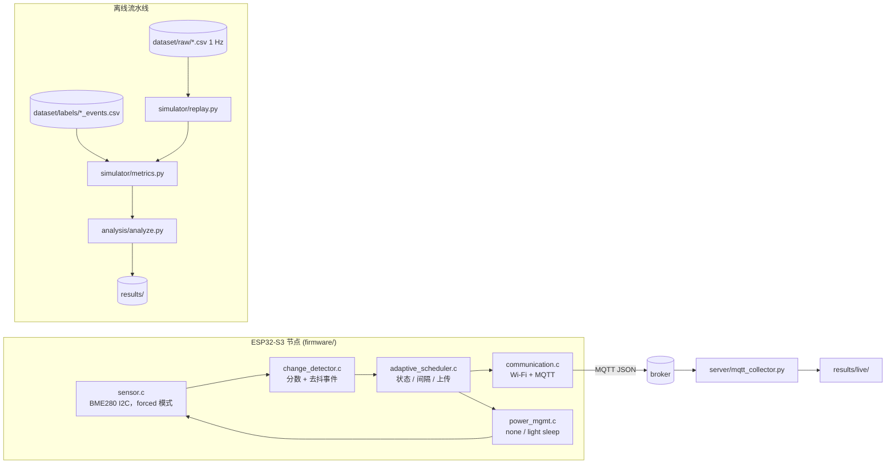

# AdaptiveSense

**面向资源受限 IoT 节点的变化感知自适应采样**

[](https://github.com/Sver0411/AdaptiveSense/actions/workflows/python-tests.yml)
[](https://github.com/Sver0411/AdaptiveSense/actions/workflows/esp-idf-build.yml)

一个基于 ESP32-S3 / ESP-IDF 的研究原型：验证**变化感知（change-aware）**的采样策略
能否在电池供电的环境节点上降低感知与通信开销，同时不牺牲事件检测能力——
并且对"答案其实是否定的那一部分"如实交代。

同一套策略有两份实现：

- **离线回放仿真器**（Python）：在带独立标注的合成基准上评估该策略与固定周期基线的表现，
  输出指标与图表；
- **ESP32-S3 固件**（ESP-IDF v5.4，C）：在真实设备上运行同一套策略。

两份实现遵循**同一份书面规范**；测试会把固件的策略源码编译到主机上，
逐样本比对两者的状态、间隔、事件与上传决策是否完全一致。

[English README](README.md) · [v0.2 对上一版的审计](docs/audit_v0.2.md)

---

## 研究问题

> 变化感知的自适应采样，能否在保持事件检测能力的前提下，
> 降低资源受限 IoT 设备的感知与通信开销？

本仓库是围绕该问题搭建的实验装置：一个可配置的自适应策略、五条固定周期基线、
一套共用的回放框架、一套带**独立真值**的指标体系，以及该策略的真机实现。

## 为什么要自适应采样

每秒上报一次的环境节点，在环境没有变化时几乎全程在浪费能量——室内场景下，
大部分时间都是如此。直觉上的答案是"少采、少发"。问题在于"少"正是让节点变盲的原因：
固定 60 s 周期下，一个持续 26 s 的扰动可能完全落在两次采样之间（下文场景 E 正是如此）。

变化感知策略想把采样预算花在有用的地方：环境安静时稀疏采样，环境变化时快速采样。
本仓库量化了这到底能换来多少收益，以及更有价值的部分——**它在哪些情况下会失败**。

## 系统

```
唤醒 → 读取 BME280（一次 forced 模式转换）→ 计算变化分数
     → 自适应策略（状态、下一次间隔、是否上传）
     → 按需通过 MQTT 上报 → 睡到下一次采样时刻
```



| 层 | 文件 | 职责 |
|----|------|------|
| 传感器 | `firmware/main/sensor.c`、`bme280_math.c` | I²C 传输、forced 模式测量、Bosch 补偿算法 |
| 变化检测 | `firmware/main/change_detector.c` | 归一化不稳定性分数 + 去抖事件 |
| 自适应策略 | `firmware/main/adaptive_scheduler.c` | 状态机、间隔阶梯、上传决策 |
| 通信 | `firmware/main/communication.c` | Wi-Fi 生命周期、MQTT 上报、上报计数 |
| 电源 | `firmware/main/power_mgmt.c` | 睡眠模式、实测睡眠时长 |
| 配置 | `firmware/main/policy_config.c` | `config.h` 宏 → 运行时结构体 |

各层之间没有反向依赖；策略层不引用任何传感器或无线驱动，
这正是同一份 C 文件能够在主机上编译并参与一致性测试的原因。

## 方法

完整规范见 [`docs/change_score_spec.md`](docs/change_score_spec.md)，要点如下：

1. **逐通道不稳定性分数**。每次采样计算三个变化指标，各自除以该通道的噪声底线
   （使不同通道可比）：
   - `dev` —— 与持久 EMA 基线的偏差（基线取**当前样本之前**的值，`alpha = dt / (dt + baseline_tau_s)`）；
   - `std` —— `variety_window_s` 窗口内的**总体**标准差；
   - `roc` —— `roc_window_s` 窗口内 `|dx/dt|` 的**均值**。

   `score_c = max(dev, std, roc) / noise_floor_c`，总分取参与通道的最大值。

2. **带迟滞的三态状态机**：`STABLE → ACTIVE → ALERT`。
   **升级是立即的**——分数远超 ACTIVE 进入阈值时，STABLE 可直接跳到 ALERT；
   **降级一次只降一级**，且必须等分数跌破当前状态的**保持阈值**，
   因此在环境仍在变化时不会草率离开 ALERT、退回最长采样间隔。

3. **间隔阶梯**：STABLE `[20, 40, 60]` s，ACTIVE `[15, 10, 5]` s，ALERT `[5]` s。
   无事时 STABLE 逐步变长；一旦有事 ACTIVE 立即变短。

4. **上传策略**：首次采样、事件起始、状态变化、间隔变化、心跳超时，
   或任一通道相对上次上传的偏移超过 `delta_threshold` 个噪声底线时上报。

5. **事件判定**：分数连续高于 `event_threshold` 达到 `event_min_duration_s` 即声明事件。

所有取值都在
[`experiments/experiment_config.yaml`](experiments/experiment_config.yaml)，
并镜像到
[`firmware/main/config.example.h`](firmware/main/config.example.h)；
`scripts/check_config_parity.py` 会在两者不一致时失败，CI 会运行它。
任何源码里都没有硬编码的可调参数。

## 实验设计

7 个合成场景，共 26 400 s 的 1 Hz 信号（[dataset/README.md](dataset/README.md)）：

| 编号 | 场景 | 时长 | 注入内容 | 用于暴露 |
|------|------|------|----------|----------|
| A | stable | 2 h | 无 | 无事时的开销 |
| B | sudden | 30 min | 一次 +5 °C 阶跃，起始点避开所有采样网格 | 阶跃检测与延迟 |
| C | mixed | 2 h | 阈值以下抖动、上升阶跃、下降阶跃 | 真实混合负载 |
| D | repeated | 1 h | 6 次不规则阶跃 + 2 次光扰动 | 重复检测、第二模态 |
| E | short event | 30 min | 26 min 平静后出现一次 26 s 尖峰 | **长间隔漏掉短事件** |
| F | noisy stable | 20 min | 无事件，噪声约为配置温度噪声底线的 7 倍 | **噪声底线不匹配时的误报** |
| G | slow drift | 1 h | 30 min 内 +3 °C，保持后返回 | **比基线更慢的变化** |

所有策略都在**同一份信号**上回放：

- Fixed-5s / 10s / 20s / 40s / 60s（固定周期基线），
- AdaptiveSense（MIN 5 s / DEFAULT 20 s / MAX 60 s）。

**真值与 AdaptiveSense 完全独立。** 标签由数据集生成器根据它自己的**无噪声驱动信号**
写出，使用绝对物理量规则（某通道被驱动偏离基线超过 `gt_label_min_deviation`
且持续 `gt_label_min_duration_s` 以上即算作扰动事件）。
策略无法影响"什么算事件"。本项目的上一版是用 AdaptiveSense 自己的分数在全分辨率信号上
推导真值，属于循环论证；详见 [docs/audit_v0.2.md](docs/audit_v0.2.md) 的问题 #6 与 #8。

**检测采用通道感知的一对一匹配。** 一个检测最多匹配一个标注事件，反之亦然；
匹配对的起始时间差即延迟（下限截断为 0），真值侧的剩余计为漏检，
检测侧的剩余计为误报。总体表格中的检测率与延迟使用**micro 聚合**（汇总计数），
而不是对各场景比率取平均。

## 仿真结果

> **合成仿真结果** —— 由 `analysis/analyze.py` 在合成基准上产生。**不是**硬件测量。

### 总体（跨 7 个场景 micro 聚合）

| 策略 | 采样数 | 上传数 | 通信降低 | 平均间隔 | 标注事件 | 检出 | 漏检 | 误报 | 其中真正误报 | 检测率 | 平均延迟 | p95 延迟 |
|------|-------:|-------:|---------:|---------:|---------:|-----:|-----:|-----:|-------------:|-------:|---------:|---------:|
| Fixed-5s | 5280 | 5280 | 80.0 % | 5.0 s | 24 | 22 | 2 | 17 | 11 | 91.7 % | 12.3 s | 14.0 s |
| Fixed-10s | 2640 | 2640 | 90.0 % | 10.0 s | 24 | 22 | 2 | 20 | 15 | 91.7 % | 17.3 s | 19.0 s |
| Fixed-20s | 1320 | 1320 | 95.0 % | 20.0 s | 24 | 19 | 5 | 20 | 19 | 79.2 % | 35.9 s | 38.1 s |
| Fixed-40s | 660 | 660 | 97.5 % | 40.0 s | 24 | 17 | 7 | 14 | 13 | 70.8 % | 62.9 s | 78.0 s |
| Fixed-60s | 440 | 440 | 98.3 % | 60.0 s | 24 | 11 | 13 | 5 | 3 | 45.8 % | 111.7 s | 118.0 s |
| **AdaptiveSense** | **1178** | **768** | **97.1 %** | **22.3 s** | **24** | **18** | **6** | **17** | **11** | **75.0 %** | **41.2 s** | **67.2 s** |

*「其中真正误报」= 不落在任何同通道标注事件区间内的误报。其余误报属于**冗余检测**：
  策略把一次物理事件看成了多次上升/下降触发，这是采样流的定义性产物，
  而非无中生有的告警。两个数字都在 `results/metrics_all.csv` 中。

从权衡角度看，AdaptiveSense 落在 **Fixed-20s 与 Fixed-40s 之间**：
97.1 % 的通信降低对应 75.0 % 的检测率，而 Fixed-20s 是 95.0 % / 79.2 %，
Fixed-40s 是 97.5 % / 70.8 %。在本基准上，变化感知策略大致等价于约 22–30 s 的固定周期——
它是在**插值**固定率的权衡曲线，而不是超越它。

### 逐场景（AdaptiveSense）

| 场景 | 采样数 | 上传数 | 标注 | 检出 | 漏检 | 检测率 | 平均延迟 |
|------|-------:|-------:|-----:|-----:|-----:|-------:|---------:|
| A stable | 122 | 120 | 0 | 0 | 0 | *N/A* | — |
| B sudden | 115 | 44 | 2 | 2 | 0 | 100 % | 35.5 s |
| C mixed | 239 | 166 | 4 | 2 | 2 | 50 % | 47.5 s |
| D repeated | 389 | 137 | 14 | 14 | 0 | 100 % | 41.1 s |
| E short event | 32 | 30 | 2 | 0 | 2 | 0 % | — |
| F noisy stable | 219 | 211 | 0 | 0 | 0 | *N/A* | — |
| G slow drift | 62 | 60 | 2 | 0 | 2 | 0 % | — |

无标注事件的场景报告 **N/A**，而不是 0 %。AdaptiveSense 的 11 次真正误报中有 5 次来自
场景 F，而所有固定策略在那里同样产生误报（1–6 次）——是配置的噪声底线无法描述该场景，
并非策略本身的问题。

### 三个"困难"场景说明了什么

这三个才是值得读的结果，因为策略正是在这里失手：

* **E —— 26 s 短事件落在 60 s 间隔里：漏检。** 任何只依据**已采到的观测**做决策的策略，
  都不可能对发生在两次采样之间的变化做出反应。这是采样式感知的固有性质，不是调参失败。
* **G —— 慢漂移：包括 Fixed-5s 在内所有策略全部漏检。** 偏差指标与时间常数
  `baseline_tau_s = 60 s` 的 EMA 比较；比该常数更慢的斜坡，其稳态偏差只有
  `速率 × tau`，永远达不到事件阈值。30 min 内 3 °C 的漂移因此对本规范下的分数是不可见的。
  要检测漂移需要更慢的参考基线或显式的趋势项——那是后续工作，不是改一个参数。
* **C —— 下降阶跃漏检，上升阶跃被检出。** 在 60 s 间隔下观测到的阶跃，
  大约只有一个采样周期的可见窗口，因为基线在一个 `baseline_tau_s` 内就追上近一半；
  而 `event_min_duration_s = 10 s` 的去抖无法由单次观测满足，事件因此从未被确认。
  去抖时长、基线时间常数与采样间隔是**相互耦合**的，当前取值不满足该耦合（见「局限」）。

完整数据：[`results/metrics_all.csv`](results/metrics_all.csv)（逐场景）、
[`results/metrics_summary.csv`](results/metrics_summary.csv)（总体）；
图表：`results/plots/`。

### 是通信开销，不是能量

报告的量是 `number_of_uploads`、`estimated_payload_bytes` 和一个无量纲的
`communication_energy_proxy`（上传数 × 一个配置常量）。
**不报告任何物理能量单位**，因为没有能量测量。上一版曾把该代理量以毫焦打印，
暗示了一个从未做过的测量。

## 硬件状态

| 项目 | 状态 |
|------|------|
| ESP32-S3 固件**构建验证** | **是** —— `idf.py set-target esp32s3 && idf.py build`，ESP-IDF v5.4.4，0 警告（[证据](docs/build_validation.md)） |
| BME280 驱动 | 已实现（寄存器级、forced 模式、Bosch 双精度补偿） |
| **真机传感器验证** | `Not measured yet.` —— 未接入过开发板 |
| **功耗测量** | `Not measured yet.` —— 未做 INA219 / Joulescope / Power Profiler 测量 |
| Wi-Fi / MQTT 连续 ≥ 5 个周期 | 已实现并在设计上论证，真机 `Not measured yet.` |
| Light sleep 电流、占空比能耗 | `Not measured yet.` |
| BH1750 光照传感器 | **未实现**（该通道被标记为无效；固件路径已预留） |
| Deep sleep | **实验性，默认禁用** —— 会重启，调度状态无法存活 |

固件分别记录 `upload_requested` 与 `publish_success`，并维护
`publish_ok` / `publish_failed` 计数，便于将来的真机实验区分"策略决定"与"实际送达"。

## 复现

依赖：Python 3.10+；固件需要 ESP-IDF v5.4；主机侧一致性测试需要一个 C 编译器。

```bash
python3 -m venv .venv && source .venv/bin/activate
pip install -r requirements.txt

python dataset/generate_dataset.py          # 重新生成原始信号 + 标签
python -m pytest tests/ -v                  # 单测、匹配、统计、一致性
python scripts/check_config_parity.py       # YAML <-> 固件 config.h
python analysis/analyze.py                  # 指标 + 图表
```

固件：

```bash
cd firmware
idf.py set-target esp32s3
idf.py build
```

构建不需要任何凭据：`firmware/main/CMakeLists.txt` 会在 `config.h`
（被 git 忽略）缺失时从提交的示例文件生成。

全流程确定性（生成器带种子、配置固定），因此重新生成数据集并重跑分析会**逐字节**复现
已提交的**数值结果**（原始信号、标签、以及所有指标/样本 CSV）。CI 用
`git diff --exit-code -- 'dataset/**/*.csv' 'results/**/*.csv'` 强制这一点。
图表则只校验"是否重新生成"，不要求逐字节一致——PNG 的字节内容取决于绘图库构建，
与实验本身无关（[说明](results/README.md)）。

## 局限

1. **结果是合成数据上的仿真结果**，仅供参考而非测量；基准规模也偏小——24 个标注事件。
2. **基准只覆盖一类环境**（类室内的温湿压光）与单一节点，泛化性未验证。
3. **传感模态有限**：建模了 3 个通道，默认只启用 2 个（温度、湿度），
   气压被禁用，光照通道在驱动里未实现。
4. **没有真机能量测量**：所有成本量都是计数与无量纲代理量。
5. **变化感知策略无法在变化被采到之前做出反应**。若短事件期间没有采样点，
   任何仅依赖采样观测的策略都无法检出（场景 E）。
6. **参数是人工选定的，且已知并非联合最优。** 特别是
   `event_min_duration_s`（10 s）并未显著小于 `baseline_tau_s`（60 s），
   导致在 60 s 间隔下观测到的阶跃无法在偏差衰减前满足去抖（场景 C）。
   这些取值是**按原配置保留的，没有为了改善已发布数字而调参**。
7. **没有与更先进的自适应采样算法对比**（变点检测、贝叶斯或信息论方法、学习式预测器）。
8. **检出事件的定义是"阈值 + 去抖"**，因此"检出"意味着"分数越过阈值并保持足够久"，
   而不是"变点被正确定位"。

## 后续工作

- **真实数据集**：按 [docs/experiment_protocol.md](docs/experiment_protocol.md)
  的流程从节点本身采集，替换合成基准。
- **真机能量测量**（INA219 / Joulescope / Nordic Power Profiler），
  把代理量变成焦耳，并验证 light sleep 占空比。
- **对漂移敏感的指标**——更慢的基线或显式趋势项——使场景 G 一类变化至少可被检出。
- **`event_min_duration_s`、`baseline_tau_s` 与阶梯的联合选参**，
  显式处理上述耦合关系。
- **与更先进的自适应采样 / 变点检测方法对比。**
- 基于 TinyML 的变化预测、LoRa 传输、多节点空间相关性。*(这些均未在本仓库实现。)*

## 仓库结构

```
AdaptiveSense/
├── firmware/       ESP-IDF C 应用（ESP32-S3）
├── simulator/      离线回放仿真器 + 规范算法实现
├── dataset/        合成生成器、原始信号与独立标签
├── experiments/    中心实验配置（YAML）
├── analysis/       指标表与图表
├── scripts/        配置一致性检查
├── tests/          单元测试 + 主机侧 Python/C 一致性测试
├── results/        仿真输出（指标 + 图表）
└── docs/           规范、方法学、审计与工程说明
```

## 许可证

[MIT](LICENSE)。`firmware/main/bme280_math.c` 中的 BME280 补偿公式取自
Bosch Sensortec 的 `BME280_SensorAPI` 驱动（BSD-3-Clause），详见文件头。
