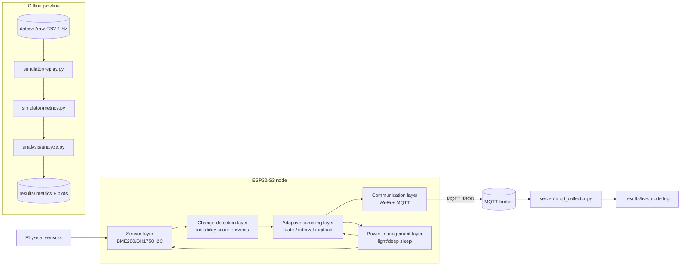

# AdaptiveSense

**面向资源受限 IoT 节点的变化感知自适应采样（Change-Aware Adaptive Sampling）**

一个研究型 IoT 项目，用于验证如下问题：*变化感知（change-aware）的自适应采样策略*
能否在资源受限设备上降低感知与通信开销，同时保持良好的事件检测能力。

项目以可复现的实验系统组织：

- **离线回放仿真器**（Python）：基于统一的 1 Hz 基准数据集（Ground Truth）评估策略，
  输出指标与图表；
- **ESP32-S3 固件**（ESP-IDF, C）：在真实硬件上运行与仿真器完全相同的策略。

[English README](README.md)

---

## 目录

- [问题背景](#问题背景)
- [研究问题](#研究问题)
- [方法](#方法)
- [系统架构](#系统架构)
- [仓库结构](#仓库结构)
- [快速开始](#快速开始)
- [实验设计](#实验设计)
- [实验结果](#实验结果)
- [局限](#局限)
- [未来工作](#未来工作)
- [许可证](#许可证)

---

## 问题背景

环境 IoT 节点持续采样并上传传感器数据。在许多部署场景中，环境长期保持稳定；
以固定高频率采样和上传会浪费能量、无线传输时间与电池寿命，而固定低频率又会漏掉事件。
如果采样策略能够随环境动态变化而自适应调整，原则上可以在不损失事件检测能力的前提下
降低平均开销。

## 研究问题

> 变化感知的自适应采样能否在资源受限的 IoT 设备上降低感知与通信开销，
> 同时保持事件检测性能？

本项目不是实现一个简单的"动态修改 delay"示例，而是围绕该研究问题构建完整的实验系统：
可配置的自适应策略、固定频率基线、共享的 Ground Truth 回放仿真器、指标体系，
以及在 ESP32-S3 上运行的相同策略固件。

## 方法

策略实现于 `simulator/adaptive.py`（固件中保持一致），由每通道**不稳定度评分**与
三状态机驱动：

1. 每次读数产生一个归一化评分，取三种变化指标中的最大值，并除以该通道的噪声底：

   - 与持久 EMA 基线的偏差；
   - 滑动窗口标准差；
   - 近期变化率。

2. **STABLE / ACTIVE / ALERT** 三状态机（带相对滞回）根据状态选择下一次采样间隔，
   间隔阶梯为：STABLE 下 20 → 40 → 60 s，ACTIVE 下 60 → 30 → 15 → 5 s，ALERT 下固定 5 s。

3. 上传策略决定哪些采样需要传输（事件发生、状态变化、间隔变化、心跳，
   或相对上次上传变化超过阈值）。

4. 事件由同一评分经最短持续时长去抖后判定。

所有阈值与参数集中放在 [`experiments/experiment_config.yaml`](experiments/experiment_config.yaml)
（Python 侧），固件侧镜像在配置文件中，代码中不硬编码调参数值。
同一套事件定义同时用于全分辨率 Ground Truth 与采样序列，因此 Ground Truth 定义
不会被人为调整为有利于某一种策略。

详见 [docs/methodology.md](docs/methodology.md)。

## 系统架构



固件按独立分层组织，接口清晰：`sensor`、`change_detector`、`adaptive_scheduler`、
`communication`、`power_mgmt`（[docs/architecture.md](docs/architecture.md)）。
自适应调度器不依赖任何传感器或无线驱动；深睡眠支持与调度策略解耦。

## 仓库结构

```
AdaptiveSense/
├── firmware/       ESP-IDF C 应用（ESP32-S3）
├── server/         MQTT 数据采集端（Python）
├── simulator/      离线回放仿真器（Python）
├── experiments/    集中实验配置（YAML）
├── analysis/       指标表格与图表
├── dataset/        Ground Truth 数据集与生成器
├── tests/          单元测试
├── results/        仿真输出（指标与图表）
└── docs/           方法与工程文档
```

## 快速开始

依赖：Python 3.10+（Linux / macOS）。固件另需 ESP-IDF v5.x，见
[docs/hardware.md](docs/hardware.md)。

```bash
# 1. Python 环境
python3 -m venv .venv
source .venv/bin/activate
pip install -r requirements.txt

# 2.（可选）重新生成合成 Ground Truth 数据集
python dataset/generate_dataset.py

# 3. 运行单元测试
python -m pytest tests/

# 4. 运行分析管线（回放全部策略 -> 指标与图表）
python analysis/analyze.py
```

生成的图表（results/plots/）：

- `sampling_count.png`
- `communication_reduction.png`
- `event_detection.png`
- `detection_latency.png`
- `accuracy_efficiency_tradeoff.png`

## 实验设计

在 1 Hz 合成 Ground Truth 上定义三个场景（[dataset/README.md](dataset/README.md)、
[docs/experiment_protocol.md](docs/experiment_protocol.md)）：

| 场景 | 内容 | 考察点 |
|------|------|--------|
| A — 稳定 | 长时间稳定条件 | AdaptiveSense 在环境稳定时是否减少采样/通信 |
| B — 突变 | 人为制造明显环境变化 | 事件检测与检测延迟 |
| C — 混合 | 稳定、小幅变化、突变、恢复 | 更真实的混合负载 |

所有策略在**同一份** Ground Truth 数据上回放：

- Fixed-5s、Fixed-10s、Fixed-20s、Fixed-40s、Fixed-60s（基线）
- AdaptiveSense（MIN 5 s / DEFAULT 20 s / MAX 60 s）

## 实验结果

> 状态：目前仅有**仿真结果** —— 由 `analysis/analyze.py` 在合成 Ground Truth
> 数据上生成。**真实硬件 / 设备端结果：尚未测量（Not measured yet.）。**
> 后续的真实测量结果将单独存放，绝不会与仿真数字混用
> （见 [results/README.md](results/README.md) 与
> [docs/experiment_protocol.md](docs/experiment_protocol.md)）。

### 仿真结果 —— 策略汇总（3 个场景平均）

| 策略 | 采样次数 | 上传次数 | 通信减少 | 平均间隔 | 事件检测率 | 漏报 | 误报 | 平均延迟 |
|------|--------:|--------:|---------:|---------:|-----------:|-----:|-----:|---------:|
| Fixed-5s | 1080 | 1080 | 80.0 % | 5.0 s | 66.7 % | 0 | 0 | 1.2 s |
| Fixed-10s | 540 | 540 | 90.0 % | 10.0 s | 66.7 % | 0 | 0.3 | 4.5 s |
| Fixed-20s | 270 | 270 | 95.0 % | 20.0 s | 66.7 % | 0 | 1.0 | 7.8 s |
| Fixed-40s | 135 | 135 | 97.5 % | 40.0 s | 66.7 % | 0 | 0.7 | 14.5 s |
| Fixed-60s | 90 | 90 | 98.3 % | 60.0 s | 50.0 % | 0.3 | 0.7 | 28.0 s |
| **AdaptiveSense** | **123** | **102** | **98.0 %** | **41.5 s** | **66.7 %** | **0** | **0** | **21.2 s** |

Ground Truth 事件仅存在于场景 B 与 C（各 2 个；场景 A 无事件），因此上述平均
检测率主要由这两个场景决定。

基于仿真数据的观察：

- 在三个场景中，**AdaptiveSense** 相对完整 1 Hz 流减少约 **98% 的传输**
  （每 5 400 s ≈102 次上传，对比 5 400 次），与最激进基线 Fixed-60s 同量级。
- 在该传输预算下，它在本实验场景内保持**完整事件检测**（0 漏报、0 误报）；
  而唯一传输量相近的基线 Fixed-60s 在混合场景中漏掉了一个事件
  （平均检测率 66.7 % → 50 %）。
- Fixed-5s/Fixed-10s 延迟最低，但上传次数要多约 5–10 倍。
  各场景的权衡曲线见
  [results/plots/accuracy_efficiency_tradeoff.png](results/plots/accuracy_efficiency_tradeoff.png)。

完整数据见 [results/metrics_all.csv](results/metrics_all.csv) 与
[results/metrics_summary.csv](results/metrics_summary.csv)。

#### 能耗

`energy_proxy_mj`（= 上传次数 × 可配置常量）是**估算 / 代理**指标，并非真实功耗测量。
按配置常量 1.0 mJ/次上传计算，AdaptiveSense 每 5 400 s 约为 102 mJ，Fixed-5s 约为
1 080 mJ —— 该代理值与传输次数成线性比例。真实能耗需在硬件上用功率计测量，
见 [docs/power_management.md](docs/power_management.md) 与 [docs/hardware.md](docs/hardware.md)。

## 局限

- 上述量化结果均为**基于合成 Ground Truth 的仿真结果**，仅具指示意义，并非测量值。
- 场景 B 中 AdaptiveSense 的检测延迟为 26 s（与 Fixed-60s 相同）：变化感知策略
  只有在观察到变化后才会加速，而该场景的事件起点恰好位于一次计划采样的稍后。
  逐场景数据见 `results/metrics_all.csv`。
- 能耗为代理值，尚无真实功耗测量。
- 仅测试了单节点与（类室内）合成负载族，对其他环境的泛化性未经验证。
- Ground Truth 数据集为合成数据，设计目的是可复现地覆盖三个场景，并不代表某一
  特定物理部署。

## 未来工作

- 基于 TinyML 的自适应感知（学习式变化检测替代固定阈值）
- LoRa 通信作为低功耗传输方案
- 多节点传感器网络（节点间的时空相关性）
- 边缘-云协同推理
- 电池感知调度（能量状态感知策略）
- 节点集群上的联邦学习

## 许可证

[MIT](LICENSE)