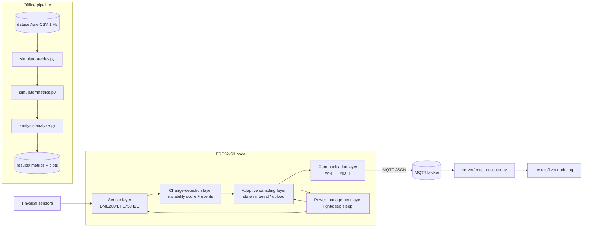

# Architecture

AdaptiveSense is organised as a layered system. The same core algorithm appears
in two "run-times":

1. an **offline replay simulator** (Python) that evaluates the policy on
   labelled ground-truth data and produces metrics and figures, and
2. an **on-device firmware** (ESP-IDF C) that runs the identical policy in real
   time on an ESP32-S3.

Because both share the same scoring/state-machine logic, simulator results are
predictive of on-device behaviour.

## System diagram



## Layering

### Sensor layer (`firmware/main/sensor.c|h`)
Abstracts the transducer(s) behind `sensor_read()` returning a temperature /
humidity / pressure / light vector with per-channel validity flags. Two
implementations: a register-level BME280 I2C driver and a clearly-labelled mock
sensor for hardware-free bring-up.

### Change-detection layer (`firmware/main/change_detector.c|h`)
Turns a stream of measurements into a **normalised instability score** per
channel and a debounced **event** bit. It keeps a small time-windowed history
per channel (for variance and rate-of-change) plus a persistent EMA change
baseline so a real change is not forgotten when the sampling interval is long.
Mirrors `simulator/adaptive.py`.

### Adaptive sampling layer (`firmware/main/adaptive_scheduler.c|h`)
Pure policy. From the score and event flag it drives a STABLE / ACTIVE / ALERT
state machine with hysteresis, walks a per-state interval ladder to choose the
next sampling interval, and decides whether to upload this sample. Holds no
reference to any sensor or radio driver.

### Communication layer (`firmware/main/communication.c|h`)
`esp_mqtt` wrapper that publishes a compact JSON payload per upload.
Credentials are read from the git-ignored `config.h`; the committed
`config.example.h` contains only placeholders.

### Power-management layer (`firmware/main/power_mgmt.c|h`)
Provides `power_sleep()` (measurable light sleep) and `power_deep_sleep()`
(power-optimal, non-returning). It is deliberately decoupled from the adaptive
scheduler so alternative power policies can be compared without touching the
sampling policy.

## Data / control flow (one duty cycle)

```
WAKE
  -> READ SENSOR
  -> EVALUATE CHANGE           (score + event)
  -> ADAPTIVE SCHEDULER         (state, interval, upload decision)
  -> DECIDE UPLOAD             (publish MQTT if upload)
  -> DETERMINE NEXT INTERVAL
  -> SLEEP until next sample
```

## Repository layout

```
AdaptiveSense/
├── firmware/       ESP-IDF C application
├── server/         MQTT data collector (Python)
├── simulator/      offline replay simulator (Python)
├── experiments/    central experiment config (YAML)
├── analysis/       metrics tables + figures
├── dataset/        ground-truth datasets + generator
├── tests/          unit tests
└── docs/           methodology & engineering docs
```