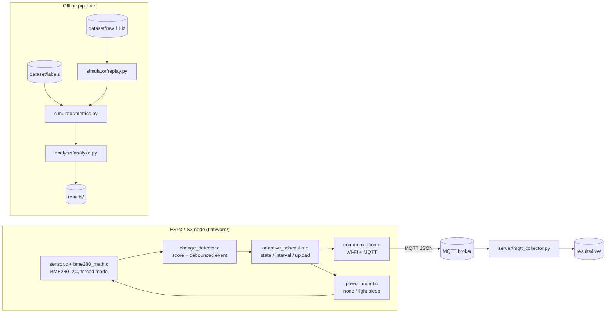

# Architecture

AdaptiveSense has one algorithm and three places it runs:

1. the **offline replay simulator** (Python) used to evaluate the policy,
2. the **on-device firmware** (ESP-IDF C) that runs it in real time on an
   ESP32-S3, and
3. a **host-side reference build** of the same C policy files, used only by the
   Python/C parity test.

All three follow [`change_score_spec.md`](change_score_spec.md).
`tests/test_parity_python_c.py` compiles `change_detector.c`,
`adaptive_scheduler.c` and `policy_config.c` for the host and asserts that
`simulator/adaptive.py` and the firmware produce identical state, interval, event
and upload decisions on a shared fixture.

## System diagram



## Layering

### Sensor layer — `sensor.c`, `sensor_backend.h`, backends, `sensor_bus.c`, `sensor_supervisor.c`

The sensor layer is **sensor-agnostic**. `sensor.c` owns only the public API, the
read contract (nothing is read before a successful init) and the choice of
backend; `sensor_backend.h` is the interface a chip driver implements:

| file | role |
|------|------|
| `sensor.c` | API, read contract, backend selection, mock override |
| `sensor_backend.h` | the backend interface (`init` / `read` / `teardown`) |
| `sensor_bme280.c` | BME280/BMP280 backend: temperature, humidity, pressure |
| `sensor_sht30.c` | SHT30/SHT3x backend: temperature, humidity |
| `sht30_proto.c` | SHT30 protocol (CRC, conversion, sequencing) — pure C, host-tested |
| `bme280_math.c` | BME280 calibration and compensation — pure C, host-tested |
| `sensor_bus.c` | the single shared I²C bus, created once and released only on wedge |
| `sensor_supervisor.c` | *when* to retry bring-up — pure C, host-tested |

A backend reports the channels it cannot measure by leaving them invalid, and the
change detector already ignores invalid channels — so swapping sensors changes
which numbers arrive, never how they are used. Backends never create an I²C bus:
`sensor_bus.c` owns it, so the SHT30, the BH1750 and the display can share the two
wires, and a bring-up retry cannot lose or duplicate the bus. `sensor_bus.c` also
performs I²C bus recovery at bring-up, because a slave holding a line low would
otherwise keep the node dead across every retry.

### Change-detection layer — `change_detector.c`, `change_detector.h`

Turns a stream of measurements into a normalised instability score per channel
and a debounced event bit. Per channel it keeps a time-ordered history bounded by
the variety window plus a persistent EMA baseline. Windows and thresholds are
runtime fields of `cd_config_t` — nothing is a compile-time constant — and the
history ring is sized from the configuration rather than guessed.

Mirrors `simulator/scoring.py`.

### Adaptive-sampling layer — `adaptive_scheduler.c`, `adaptive_scheduler.h`

Pure policy. From the score and the event flag it drives the
STABLE/ACTIVE/ALERT state machine with hysteresis, walks the per-state interval
ladder, and decides whether this sample should be uploaded. It holds no reference
to any sensor, radio or timing driver — which is why it compiles on a host.

Mirrors `simulator/adaptive.py`.

### Communication layer — `communication.c`, `communication_payload.c`, `communication.h`

Wi-Fi bring-up, the modem-sleep power save, and a thin esp-mqtt wrapper that
publishes one JSON payload per requested upload. The payload format lives in
`communication_payload.c`, which is pure C and host-tested — an unavailable
channel is emitted as `null` with an explicit `valid` map rather than as a
plausible `0`. Every publish attempt is counted and its outcome returned, so
`upload_requested` and `publish_call_ok` are distinguishable in the log.

### Power-management layer — `power_mgmt.c`, `power_mgmt.h`

`power_init()` configures the ESP-IDF power manager (`esp_pm_configure()` with
`light_sleep_enable`), `power_sleep()` idles with `vTaskDelay()` and lets FreeRTOS
tickless idle put the chip into light sleep, and a PM callback records how often
that actually happened. Decoupled from the policy so power strategies can be
compared without touching scheduling. It never stops the radio — see
[power_management.md](power_management.md).

### Configuration layer — `policy_config.c`, `policy_config.h`, `config_include.h`

The one place where `CONFIG_AS_*` macros become `cd_config_t` / `as_config_t`.
Because both `main.c` and the host-side parity harness call the same two
functions, the parity test verifies the *device's* configuration rather than a
copy of it. `config_include.h` holds the "use `config.h` if present, else the
committed example" fallback in one place, which is what lets any of these files
build on a workstation. `scripts/check_config_parity.py` additionally checks that
`policy_config.c` contains no numeric literals.

## Data / control flow (one duty cycle)

```
IDLE until the scheduled sample time   (vTaskDelay; ESP-IDF may enter light sleep)
  → READ SENSOR                 (bounded forced-mode conversion)
  → EVALUATE CHANGE             (score + debounced event)
  → ADAPTIVE POLICY             (state, next interval, upload decision)
  → PUBLISH if requested        (MQTT client outcome recorded)
  → DETERMINE NEXT WAKE
```

A failed sensor read does **not** push a zeroed sample into the detector — the
EMA baseline would be poisoned by the zeros. The node retries after
`min_interval`; if the sensor has never come up, the same interval rate-limits
re-initialisation.

## Offline pipeline

```
dataset/raw/*.csv ──┐
                    ├─> simulator/replay.py ──> RunResult (samples, uploads, decisions, detections)
dataset/labels ─────┘                              │
                                                   v
                                      simulator/metrics.py (matching + metrics)
                                                   │
                                                   v
                                      analysis/analyze.py ──> results/ + plots/
```

`simulator/replay.py` replays every strategy over the same signal;
`dataset/labels/` supplies the ground truth and is never produced by the policy.

## Host-side test harnesses

Four of the firmware's translation units have no ESP-IDF dependency (or compile in
mock mode behind the test shim in `tests/c_host/shims/`), which is what makes the
following possible without an ESP32 on the desk:

| driver | units under test | test module |
|--------|------------------|-------------|
| `tests/c_host/parity_main.c` | `change_detector.c`, `adaptive_scheduler.c`, `policy_config.c` | `test_parity_python_c.py` |
| `tests/c_host/bme280_host_main.c` | `bme280_math.c` | `test_bme280_math.py` |
| `tests/c_host/payload_host_main.c` | `communication_payload.c` | `test_communication_payload.py` |
| `tests/c_host/sensor_host_main.c` | `sensor.c` (mock), `sensor_supervisor.c` | `test_sensor_contract.py`, `test_sensor_supervisor.py` |

`tests/host_build.py` holds the shared compiler discovery and build flags, so a
change to the build flags cannot be applied to one harness and forgotten in
another.

## Repository layout

```
AdaptiveSense/
├── firmware/       ESP-IDF C application
├── simulator/      offline replay simulator + normative scoring
├── dataset/        generator, raw signals, independent labels
├── experiments/    central experiment configuration
├── analysis/       metrics tables and figures
├── scripts/        configuration parity check
├── tests/          unit tests + host-side C harnesses
├── results/        simulation outputs
└── docs/           specification, methodology, audit, engineering notes
```
