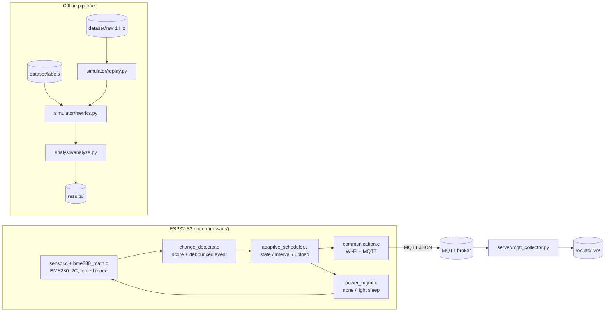

# Architecture

AdaptiveSense has one algorithm and three places it runs:

1. the **offline replay simulator** (Python) used to evaluate the policy,
2. the **on-device firmware** (ESP-IDF C) that runs it in real time on an
   ESP32-S3, and
3. a **host-side reference build** of the same C policy files, used only by the
   Python/C parity test.

All three follow [`change_score_spec.md`](change_score_spec.md).
`tests/test_parity_python_c.py` compiles `change_detector.c`,
`adaptive_scheduler.c` and `policy_config.c` for the host and asserts that
`simulator/adaptive.py` and the firmware produce identical state, interval, event
and upload decisions on a shared fixture.

## System diagram



## Layering

### Sensor layer — `sensor.c`, `bme280_math.c`, `sensor.h`

`bme280_math.c` is pure C99 with no ESP-IDF dependency: calibration parsing, raw
register decoding and the vendor compensation equations, all host-testable.
`sensor.c` owns I²C transport, chip bring-up, the forced-mode measurement
sequence with its bounded wait, and the mapping into `sensor_read_t`. Splitting
the maths out is what allows `tests/test_bme280_math.py` to verify the driver
without a board.

### Change-detection layer — `change_detector.c`, `change_detector.h`

Turns a stream of measurements into a normalised instability score per channel
and a debounced event bit. Per channel it keeps a time-ordered history bounded by
the variety window plus a persistent EMA baseline. Windows and thresholds are
runtime fields of `cd_config_t` — nothing is a compile-time constant — and the
history ring is sized from the configuration rather than guessed.

Mirrors `simulator/scoring.py`.

### Adaptive-sampling layer — `adaptive_scheduler.c`, `adaptive_scheduler.h`

Pure policy. From the score and the event flag it drives the
STABLE/ACTIVE/ALERT state machine with hysteresis, walks the per-state interval
ladder, and decides whether this sample should be uploaded. It holds no reference
to any sensor, radio or timing driver — which is why it compiles on a host.

Mirrors `simulator/adaptive.py`.

### Communication layer — `communication.c`, `communication.h`

Wi-Fi bring-up, the modem-sleep power save, and a thin esp-mqtt wrapper that
publishes one JSON payload per requested upload. Every publish attempt is counted
and its outcome returned, so `upload_requested` and `publish_success` are
distinguishable in the log.

### Power-management layer — `power_mgmt.c`, `power_mgmt.h`

`power_sleep()` (mode-configurable, returns the measured elapsed time) and
`power_deep_sleep()` (documented primitive, rejected by the default
configuration). Decoupled from the policy so power strategies can be compared
without touching scheduling. It never stops the radio — see
[power_management.md](power_management.md).

### Configuration layer — `policy_config.c`, `policy_config.h`

The one place where `CONFIG_AS_*` macros become `cd_config_t` / `as_config_t`.
Because both `main.c` and the host-side parity harness call the same two
functions, the parity test verifies the *device's* configuration rather than a
copy of it. `scripts/check_config_parity.py` additionally checks that this file
contains no numeric literals.

## Data / control flow (one duty cycle)

```
SLEEP until the scheduled sample time
  → READ SENSOR                 (bounded forced-mode conversion)
  → EVALUATE CHANGE             (score + debounced event)
  → ADAPTIVE POLICY             (state, next interval, upload decision)
  → PUBLISH if requested        (outcome recorded)
  → DETERMINE NEXT WAKE
```

A failed sensor read does **not** push a zeroed sample into the detector — the
EMA baseline would be poisoned by the zeros. The node retries after
`min_interval` instead.

## Offline pipeline

```
dataset/raw/*.csv ──┐
                    ├─> simulator/replay.py ──> RunResult (samples, uploads, decisions, detections)
dataset/labels ─────┘                              │
                                                   v
                                      simulator/metrics.py (matching + metrics)
                                                   │
                                                   v
                                      analysis/analyze.py ──> results/ + plots/
```

`simulator/replay.py` replays every strategy over the same signal;
`dataset/labels/` supplies the ground truth and is never produced by the policy.

## Repository layout

```
AdaptiveSense/
├── firmware/       ESP-IDF C application
├── simulator/      offline replay simulator + normative scoring
├── dataset/        generator, raw signals, independent labels
├── experiments/    central experiment configuration
├── analysis/       metrics tables and figures
├── scripts/        configuration parity check
├── tests/          unit tests + host-side parity harness
├── results/        simulation outputs
└── docs/           specification, methodology, audit, engineering notes
```
